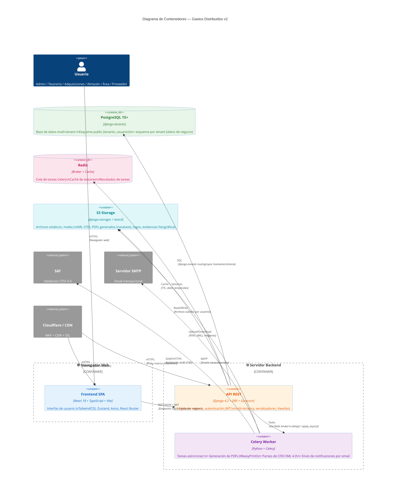
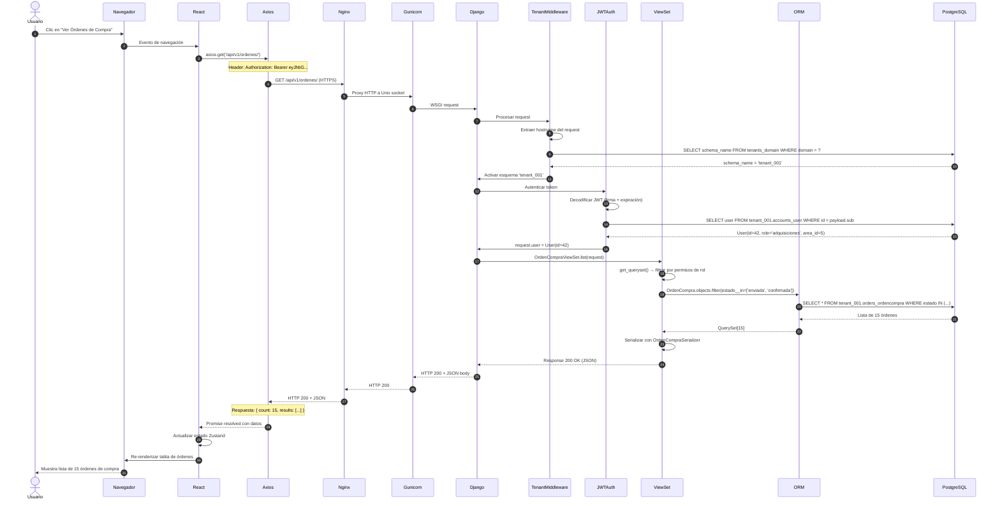
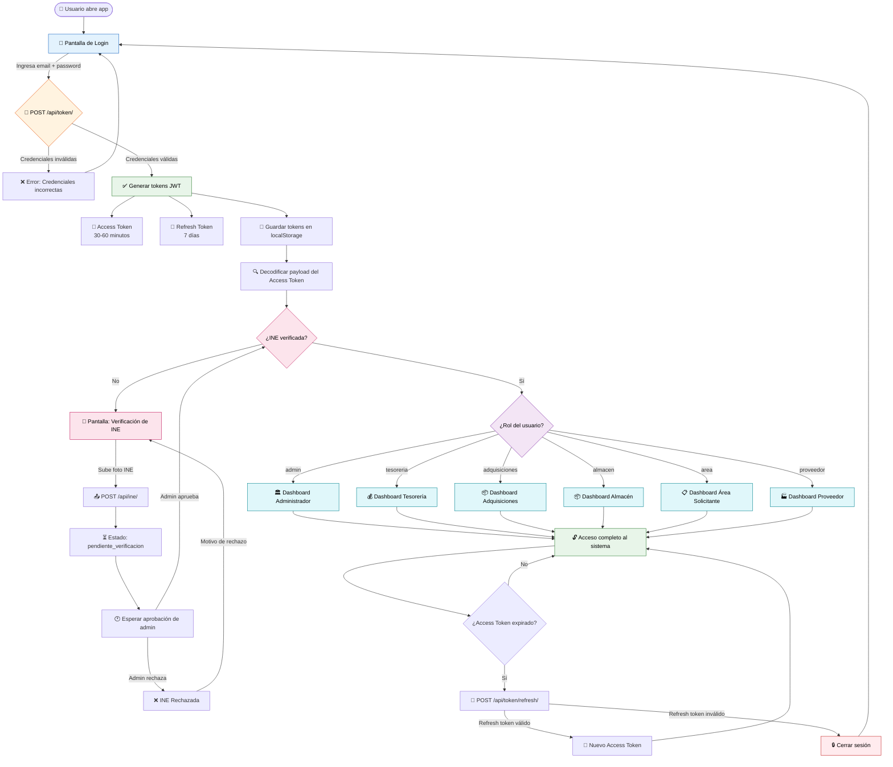

# Arquitectura del Sistema — Diagramas

Documento con diagramas de la arquitectura cliente-servidor de Gastos Distribuidos v2.

---

## Tabla de Contenidos

1. [Diagrama C4 Container (Vista de Alto Nivel)](#1-diagrama-c4-container-vista-de-alto-nivel)
2. [Diagrama de Secuencia: Request JWT Autenticado](#2-diagrama-de-secuencia-request-jwt-autenticado)
3. [Diagrama de Flujo: Proceso de Autenticación](#3-diagrama-de-flujo-proceso-de-autenticación)

---

## 1. Diagrama C4 Container (Vista de Alto Nivel)

Vista de contenedores del sistema. Muestra las aplicaciones principales, las bases de datos y los servicios externos.

### Descripción de Contenedores

| Contenedor | Tecnología | Propósito |
|-----------|-----------|-----------|
| **Frontend SPA** | React 18 + TypeScript + Vite | Interfaz de usuario. Single Page Application con TailwindCSS para estilos, Zustand para estado global, Axios para HTTP, React Router para navegación. |
| **API REST** | Django 4.2 + DRF + Gunicorn | Backend monolítico modular. 13 apps Django. Maneja autenticación JWT, multi-tenancy (schema-per-tenant), serialización, validación y ORM. |
| **Celery Worker** | Python + Celery + Redis | Procesamiento asíncrono. Genera PDFs con WeasyPrint, parsea XML CFDI 4.0 con lxml, envía emails, crea notificaciones. |
| **PostgreSQL** | 15+ con django-tenants | Base de datos relacional. Esquema `public` (tenants, dominios, usuarios, roles) + un esquema aislado por cada tenant (todas las tablas de negocio). |
| **Redis** | 7.x | Broker de tareas para Celery, caché de sesiones y resultados de tareas. |
| **S3 Storage** | django-storages + boto3 | Almacenamiento de archivos: XML CFDI, PDFs, avatares, logos, membretes, evidencias fotográficas, documentos de proveedor. |

### Servicios Externos

| Servicio | Protocolo | Uso |
|----------|-----------|-----|
| **SAT** | SOAP/HTTPS | Validación de UUID de comprobantes fiscales digitales (CFDI 4.0). |
| **SMTP** | SMTP | Envío de notificaciones transaccionales: nuevas solicitudes, cotizaciones recibidas, órdenes confirmadas, facturas procesadas. |
| **Cloudflare / CDN** | HTTPS | WAF (protección DDoS), CDN de assets estáticos, terminación SSL/TLS. |

---

## 2. Diagrama de Secuencia: Request JWT Autenticado

Flujo completo de una petición autenticada desde el navegador hasta la base de datos y de vuelta.

### Pasos Clave del Flujo

| Paso | Componente | Acción |
|------|-----------|--------|
| 1-3 | **Cliente** | Usuario interactúa con la SPA. React usa Axios para hacer la petición HTTP. |
| 4-5 | **Proxy** | Nginx recibe HTTPS y proxya a Gunicorn (WSGI). |
| 6-9 | **Multi-tenancy** | `TenantMiddleware` identifica el tenant por hostname, consulta el esquema en PostgreSQL (tabla `public.tenants_domain`), y activa el schema correcto antes de procesar la petición. |
| 10-13 | **Autenticación JWT** | `JWTAuthentication` decodifica el Bearer token, valida firma y expiración, consulta el usuario en el schema del tenant, y lo asigna a `request.user`. |
| 14-18 | **Lógica de Negocio** | El `ViewSet` aplica filtros según el rol del usuario (object-level permissions), consulta el ORM, serializa los resultados y devuelve JSON paginado. |
| 19-23 | **Respuesta** | El JSON viaja de vuelta por la misma cadena: Django → Gunicorn → Nginx → Axios → React → DOM. |

---

## 3. Diagrama de Flujo: Proceso de Autenticación

Flujo completo desde el login del usuario hasta el acceso al dashboard, incluyendo verificación de INE y redirección por rol.

### Estados del Flujo de Autenticación

| Estado | Descripción |
|--------|-------------|
| **Login** | Pantalla inicial. Solicita email y contraseña. |
| **Token Generation** | Django valida credenciales contra `User` (email como username). Genera par de tokens: access (corto) + refresh (largo). |
| **INE Verification** | Nuevos usuarios deben subir foto de INE. El admin la aprueba/rechaza. Hasta entonces, el estado de la primera solicitud es `pendiente_verificacion`. |
| **Role-Based Redirect** | Según el rol del usuario (`admin`, `tesoreria`, `adquisiciones`, `almacen`, `area`, `proveedor`), se redirige a un dashboard diferente con permisos y vistas específicas. |
| **Token Refresh** | Cuando el access token expira, el frontend usa el refresh token para obtener uno nuevo sin pedir credenciales de nuevo. Si el refresh token también expira, se cierra sesión. |

### Matriz de Roles y Dashboards

| Rol | Dashboard Principal | Funciones Destacadas |
|-----|---------------------|----------------------|
| **admin** | Panel de administración | Gestión de tenants, usuarios, configuraciones globales, aprobación de INEs. |
| **tesoreria** | Finanzas y pagos | Autorización presupuestal, procesamiento de facturas CFDI, solicitudes de pago, reportes financieros. |
| **adquisiciones** | Compras | Solicitudes de material, cotizaciones, órdenes de compra, autorizaciones. |
| **almacen** | Inventario | Recepción de bienes, salidas de almacén, evidencias fotográficas, control de stock. |
| **area** | Solicitante | Crear solicitudes de material, dar seguimiento a estados, confirmar recepciones. |
| **proveedor** | Portal de proveedor | Recibir invitaciones a cotizar, enviar cotizaciones, confirmar órdenes de compra. |

---

*Documento generado con los skills mermaid-diagrams y diagramming-code. Última actualización: mayo 2026.*
