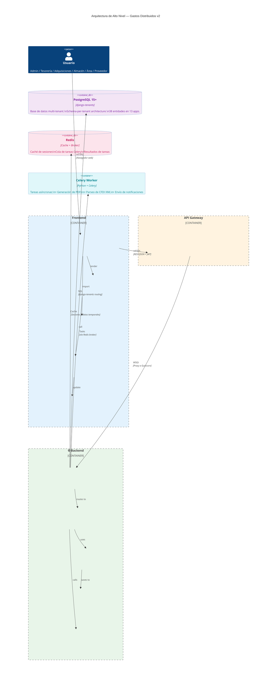
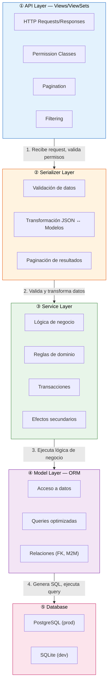
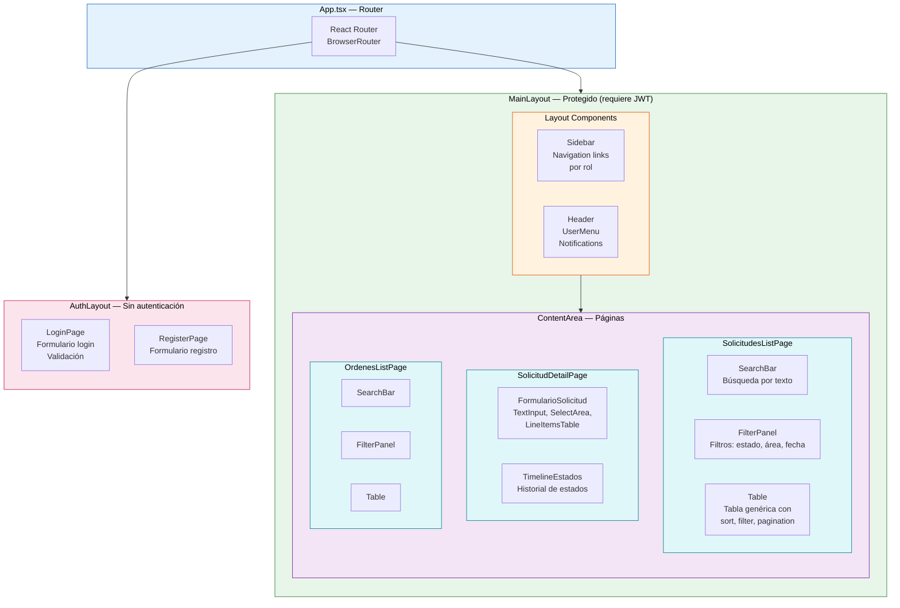
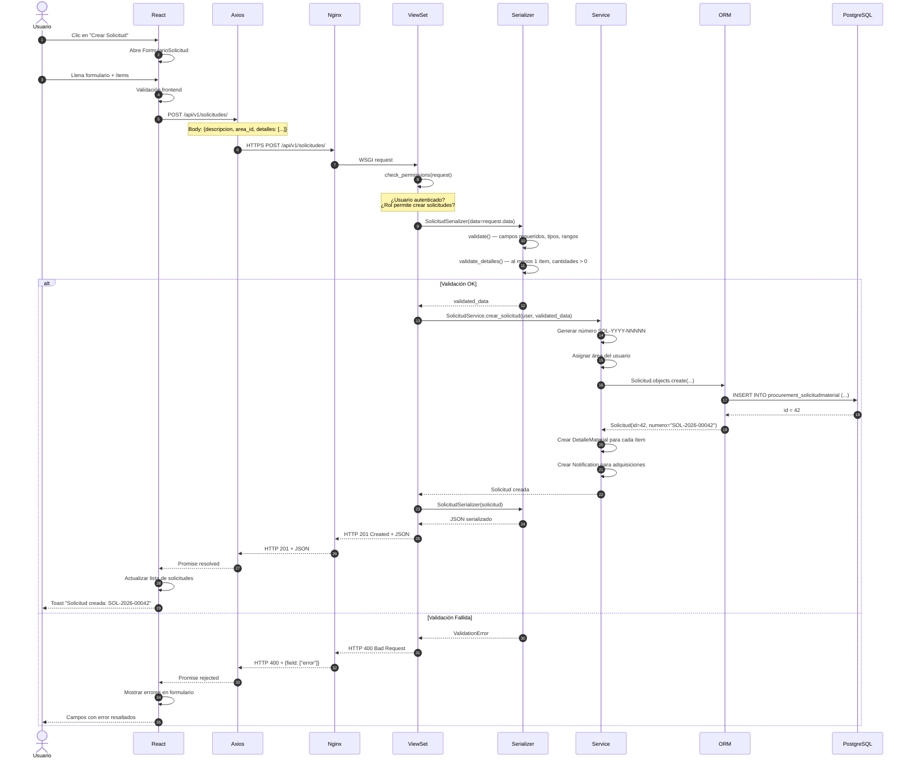

# Arquitectura Interna — Diagramas Mermaid

Diagramas de la estructura interna del sistema Gastos Distribuidos v2.
Complemento de `ARCHITECTURE.md` (que contiene ADRs, permisos, patrones de diseño).

---

## Tabla de Contenidos

1. [Arquitectura de Alto Nivel](#1-arquitectura-de-alto-nivel)
2. [Arquitectura en Capas del Backend](#2-arquitectura-en-capas-del-backend)
3. [Estructura de Apps Django](#3-estructura-de-apps-django)
4. [Jerarquía de Componentes React](#4-jerarquía-de-componentes-react)
5. [Flujo de Request Típico](#5-flujo-de-request-típico)

---

## 1. Arquitectura de Alto Nivel

Vista general del sistema: Frontend SPA → API Gateway → Backend → Capa de datos.



### Descripción de Componentes

| Nivel | Componente | Tecnología | Propósito |
|-------|-----------|-----------|-----------|
| **Frontend** | React SPA | React 18 + TypeScript + Vite | Interfaz de usuario con TailwindCSS, Zustand para estado, Axios para HTTP |
| **Frontend** | Pages | React Components | Páginas principales: Login, Dashboard, Solicitudes, Cotizaciones, Órdenes |
| **Frontend** | Components | UI Components | Componentes reutilizables: Tablas, Formularios, Modales, Inputs |
| **Frontend** | Services | Axios + API clients | Servicios HTTP: authService, solicitudesService, ordenesService |
| **Frontend** | State Mgmt | Zustand | Estado global: authStore (usuario, tokens), uiStore (tema, sidebar) |
| **Gateway** | Nginx | Reverse Proxy | Rate Limiting, SSL/TLS, Load Balancing, Static file serving |
| **Backend** | Django DRF | Django 4.2 + DRF + Gunicorn | API RESTful, autenticación JWT, multi-tenancy |
| **Backend** | Views/ViewSets | DRF ViewSets | Endpoints API: list, create, retrieve, update, destroy |
| **Backend** | Serializers | DRF Serializers | Validación de datos, transformación JSON ↔ Modelos, paginación |
| **Backend** | Models | Django ORM | Acceso a datos, consultas SQL, relaciones entre entidades |
| **Backend** | Services | Business Logic | Lógica de negocio, reglas de dominio, transacciones |
| **Data** | PostgreSQL | 15+ con django-tenants | Base de datos relacional, schema-per-tenant, 38 entidades |
| **Data** | Redis | Cache + Broker | Caché de sesiones, cola de tareas Celery, resultados de tareas |
| **Async** | Celery Worker | Python + Celery | Tareas asíncronas: PDFs, CFDI parsing, notificaciones |

---

## 2. Arquitectura en Capas del Backend

Las 5 capas del backend con el flujo de un request típico.



### Flujo de Request Típico

**Ejemplo: POST /api/solicitudes/**

| Paso | Capa | Acción |
|------|------|--------|
| 1 | **API Layer** | `SolicitudViewSet.create()` recibe el request, verifica permisos del usuario |
| 2 | **Serializer Layer** | `SolicitudSerializer` valida los datos (campos requeridos, tipos, rangos) |
| 3 | **Service Layer** | `SolicitudService.crear_solicitud()` ejecuta la lógica de negocio: genera número SOL-YYYY-NNNNN, asigna área, crea notificaciones |
| 4 | **Model Layer** | `Solicitud.objects.create()` genera el SQL INSERT y ejecuta la query |
| 5 | **Database** | PostgreSQL guarda el registro en el schema del tenant activo |
| 6 | **Serializer Layer** | `SolicitudSerializer` serializa el objeto creado a JSON |
| 7 | **API Layer** | `SolicitudViewSet` devuelve Response 201 Created con el JSON serializado |

---

## 3. Estructura de Apps Django

Los 13 módulos Django organizados por dominio funcional, con su estructura interna.

```mermaid
flowchart LR
    subgraph core["🔐 Core"]
        direction TB
        accounts["accounts\nmodels\nserializers\nviews\npermissions\nurls"]
        tenants["tenants\nmodels\nviews\nurls"]
    end

    subgraph org["🏢 Organización"]
        direction TB
        companies["companies\nmodels\nserializers\nviews\nurls"]
        areas["areas\nmodels\nserializers\nviews\nurls"]
    end

    subgraph proc["📋 Procuración"]
        direction TB
        procurement["procurement\nmodels\nserializers\nviews\nurls\nservices"]
        quotations["quotations\nmodels\nserializers\nviews\nurls"]
        orders["orders\nmodels\nserializers\nviews\nurls"]
    end

    subgraph inv["📦 Inventario"]
        direction TB
        inventory["inventory\nmodels\nserializers\nviews\nurls"]
    end

    subgraph fin["💰 Finanzas"]
        direction TB
        invoices["invoices\nmodels\nserializers\nviews\nurls\ntasks"]
        treasury["treasury\nmodels\nserializers\nviews\nurls"]
        budget["budget\nmodels\nserializers\nviews\nurls"]
    end

    subgraph support["📎 Soporte"]
        direction TB
        documents["documents\nmodels\nserializers\nviews\ntasks"]
        notifications["notifications\nmodels\nserializers\nviews"]
        reports["reports\nviews\nservices"]
    end

    core --> org
    org --> proc
    proc --> inv
    inv --> fin
    fin --> support

    style core fill:#e3f2fd,stroke:#1565c0,color:#000
    style org fill:#e8f5e9,stroke:#2e7d32,color:#000
    style proc fill:#fff3e0,stroke:#e65100,color:#000
    style inv fill:#fce4ec,stroke:#c2185b,color:#000
    style fin fill:#f3e5f5,stroke:#7b1fa2,color:#000
    style support fill:#e0f7fa,stroke:#00838f,color:#000
```



### Apps por Dominio

| Dominio | Apps | Entidades |
|---------|------|-----------|
| **Core** | `accounts`, `tenants` | User, Role, Tenant, Domain, SolicitudGubernamental |
| **Organización** | `companies`, `areas` | Company, Proveedor, ProductoProveedor, FirmanteDocumento, Area, PersonalArea |
| **Procuración** | `procurement`, `quotations`, `orders` | Cog, SolicitudMaterial, DetalleMaterial, CotizacionMaterial, CotizacionDetalle, SolicitudAutorizacion, AutorizacionPresupuestal, OrdenCompra, DetalleOrden |
| **Inventario** | `inventory` | EntregaBienes, EntregaDetalle, EvidenciaEntrega, SalidaBienes, SalidaDetalle |
| **Finanzas** | `invoices`, `treasury`, `budget` | Factura, FacturaDetalle, DistribucionGasto, SolicitudGasto, ItemSolicitudGasto, SolicitudPago, ItemSolicitudPago, PlantillaPresupuestal, ItemClavePres |
| **Soporte** | `documents`, `notifications`, `reports` | PDFDocument, Media, Notification, ActivityLog, Reportes |

### Estructura Interna de Cada App

Cada app Django sigue esta estructura:

```
app/
├── models.py          # Modelos de datos (Django ORM)
├── serializers.py     # Validación y transformación de datos (DRF)
├── views.py           # ViewSets con la lógica de API
├── permissions.py     # Permisos por rol (IsAdmin, IsTesoreria, etc.)
├── urls.py            # Rutas específicas del módulo
├── services.py        # Lógica de negocio reutilizable (opcional)
├── tasks.py           # Tareas Celery asíncronas (opcional)
└── migrations/        # Historial de cambios de BD
```

---

## 4. Jerarquía de Componentes React

Estructura de componentes del frontend, desde el router hasta los componentes de UI.



### Flujo de Datos en el Frontend

```
Usuario interactúa con Componente
    ↓
Componente llama a Service (Axios)
    ↓
Service hace HTTP request a API
    ↓
API responde con JSON
    ↓
Service actualiza Zustand Store
    ↓
Store notifica a Componentes suscritos
    ↓
Componentes se re-renderizan con nuevos datos
```

### Estado Global (Zustand)

| Store | Propósito | Datos |
|-------|-----------|-------|
| `authStore` | Autenticación | user, access_token, refresh_token, isAuthenticated |
| `uiStore` | Interfaz | theme, sidebarOpen, notifications, loading |
| `filterStore` | Filtros globales | estado, área, fecha desde/hasta |

---

## 5. Flujo de Request Típico

Secuencia completa de un request POST para crear una Solicitud de Material.



### Resumen del Flujo

| Paso | Componente | Acción | Resultado |
|------|-----------|--------|-----------|
| 1-4 | **Frontend** | Usuario llena formulario, validación cliente | Datos listos para enviar |
| 5-6 | **HTTP** | Axios → Nginx → Gunicorn | Request llega al backend |
| 7-8 | **Permisos** | ViewSet verifica autenticación y rol | ¿Puede crear solicitudes? |
| 9-11 | **Validación** | Serializer valida campos y reglas de negocio | ¿Datos válidos? |
| 12-18 | **Lógica** | Service genera número, asigna área, guarda en BD | Solicitud creada |
| 19-20 | **Efectos** | Service crea notificaciones para adquisiciones | Notificación enviada |
| 21-26 | **Respuesta** | Serializer → ViewSet → Nginx → Axios → React | 201 Created + datos |
| 27-28 | **UI** | React actualiza lista, muestra toast | Usuario ve confirmación |

---

*Documento generado con los skills mermaid-diagrams y mermaid-diagram-specialist. Última actualización: mayo 2026.*
