# 🗄️ Esquema de Base de Datos — Gastos Distribuidos v2

Modelo de datos: **38 entidades** en **13 aplicaciones** Django.
Arquitectura multi-tenant con **django-tenants** (esquema por tenant en PostgreSQL 15+).

---

## Tabla de Contenidos

1. [Resumen de Módulos](#1-resumen-de-módulos)
2. [Multi-tenancy](#2-multi-tenancy)
3. [Usuarios y Roles](#3-usuarios-y-roles)
4. [Compañías y Proveedores](#4-compañías-y-proveedores)
5. [Áreas y Personal](#5-áreas-y-personal)
6. [Clasificador por Objeto del Gasto (COG)](#6-clasificador-por-objeto-del-gasto-cog)
7. [Flujo de Procuración](#7-flujo-de-procuración)
8. [Inventario](#8-inventario)
9. [Facturación CFDI 4.0](#9-facturación-cfdi-40)
10. [Distribución de Gastos](#10-distribución-de-gastos)
11. [Tesorería y Presupuestos](#11-tesorería-y-presupuestos)
12. [Documentos, Media y Auditoría](#12-documentos-media-y-auditoría)
13. [Índices y Optimización](#13-índices-y-optimización)
14. [Migraciones y Backup](#14-migraciones-y-backup)

---

## 1. Resumen de Módulos

| Módulo | App Django | Entidades | Tablas |
|--------|-----------|-----------|--------|
| **Multi-tenancy** | `tenants` | Tenant, Domain, SolicitudGubernamental | 3 |
| **Usuarios** | `accounts` | Role, User | 2 |
| **Compañías** | `companies` | Company, Proveedor, ProductoProveedor, FirmanteDocumento | 4 |
| **Áreas** | `areas` | Area, PersonalArea | 2 |
| **Catálogo COG** | `procurement` | Cog | 1 |
| **Solicitudes** | `procurement` | SolicitudMaterial, DetalleMaterial | 2 |
| **Cotizaciones** | `quotations` | CotizacionMaterial, CotizacionDetalle | 2 |
| **Autorizaciones y Órdenes** | `orders` | SolicitudAutorizacion, AutorizacionPresupuestal, OrdenCompra, DetalleOrden | 4 |
| **Inventario** | `inventory` | EntregaBienes, EntregaDetalle, EvidenciaEntrega, SalidaBienes, SalidaDetalle | 5 |
| **Facturación** | `invoices` | Factura, FacturaDetalle | 2 |
| **Distribución** | `invoices` | DistribucionGasto | 1 |
| **Tesorería** | `treasury` | SolicitudGasto, ItemSolicitudGasto, SolicitudPago, ItemSolicitudPago | 4 |
| **Presupuestos** | `budget` | PlantillaPresupuestal, ItemClavePres | 2 |
| **Documentos** | `documents` | PDFDocument, Media | 2 |
| **Notificaciones** | `notifications` | Notification, ActivityLog | 2 |
| **Total** | **13 apps** | | **38** |

**Conexiones entre módulos:** Documentadas en tablas de "Relaciones externas" dentro de cada sección. **No se dibujan líneas cruzadas** entre diagramas para mantener la legibilidad.

---

## 2. Multi-tenancy

Arquitectura **schema-per-tenant** vía django-tenants.

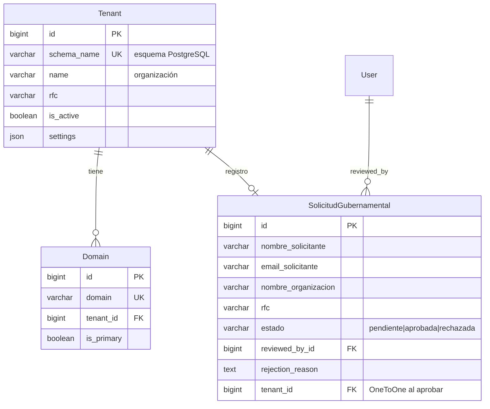

**Relaciones externas:**

| Tabla | Campo FK | Referencia |
|-------|----------|------------|
| SolicitudGubernamental | `reviewed_by_id` | `User.id` |

**Nota:** El esquema `public` de PostgreSQL solo contiene Tenant, Domain y SolicitudGubernamental. Cada tenant tiene su propio esquema con todas las demás tablas de negocio replicadas.

---

## 3. Usuarios y Roles

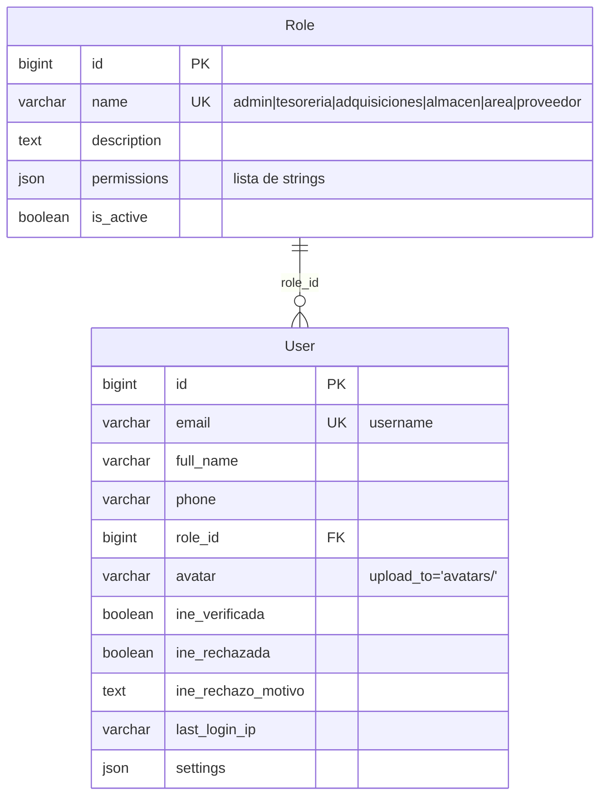

**Relaciones externas (User como FK en otras tablas):**

| Tabla externa | Campo FK | Uso |
|---------------|----------|-----|
| SolicitudGubernamental | `reviewed_by_id` | Revisión de registro |
| Proveedor | `user_id` | Perfil de proveedor (OneToOne) |
| Company | `created_by_id` | Quién creó la compañía |
| Area | `manager_id` | Responsable del área |
| PersonalArea | `user_id` | Usuario asignado al área |
| FirmanteDocumento | `user_id` | Firmante del documento |
| SolicitudMaterial | `created_by_id` | Quién creó la solicitud |
| CotizacionMaterial | — | (vía proveedor) |
| SolicitudAutorizacion | `solicitante_id` | Quién solicita autorización |
| AutorizacionPresupuestal | `aprobado_por_id` | Quién aprueba presupuesto |
| OrdenCompra | `created_by_id` | Quién creó la orden |
| EntregaBienes | `recibido_por_id` | Quién recibió bienes |
| SalidaBienes | `responsable_id` | Responsable de salida |
| Factura | `uploaded_by_id` | Quién subió la factura |
| DistribucionGasto | `created_by_id` | Quién distribuyó el gasto |
| SolicitudGasto | `solicitante_id` | Solicitante de gasto |
| PlantillaPresupuestal | `created_by_id` | Creador de plantilla |
| PDFDocument | `generated_by_id` | Quién generó el PDF |
| Media | `owner_id` | Dueño del archivo |
| Notification | `user_id` | Destinatario |
| ActivityLog | `user_id` | Quién realizó la acción |

---

## 4. Compañías y Proveedores

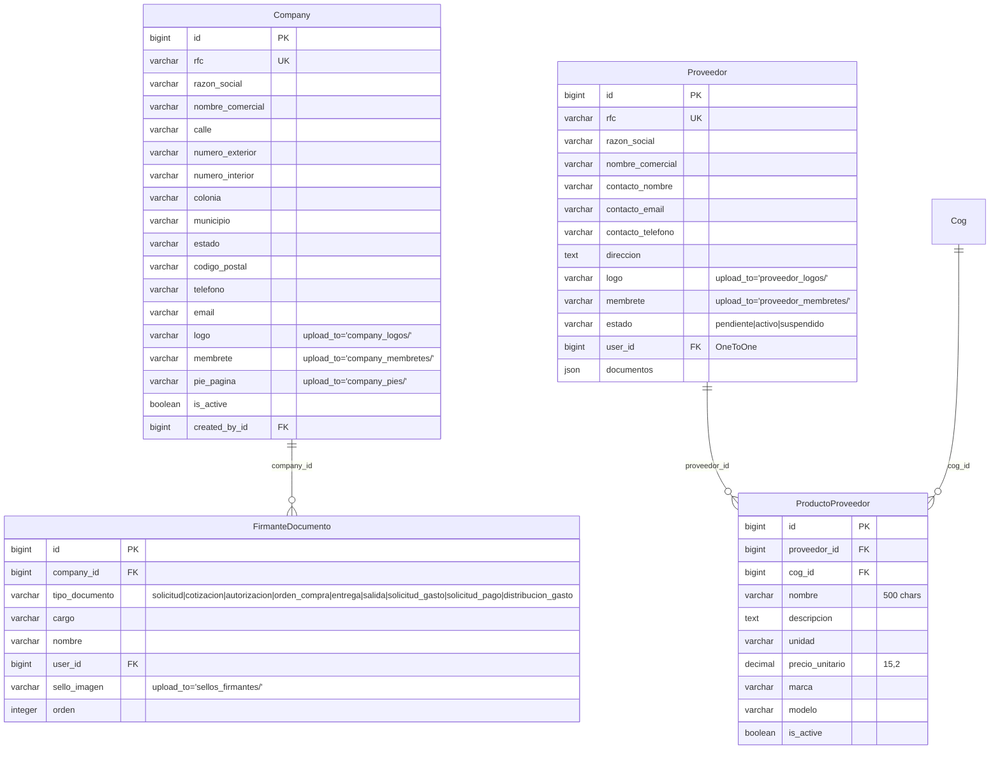

**Relaciones externas:**

| Tabla | Campo FK | Referencia |
|-------|----------|------------|
| Company | `created_by_id` | `User.id` |
| Proveedor | `user_id` | `User.id` (OneToOne) |
| FirmanteDocumento | `user_id` | `User.id` |
| ProductoProveedor | `cog_id` | `Cog.id` |

**Constraints de unicidad:**

| Tabla | Constraint |
|-------|-----------|
| Proveedor | `rfc` UK, `user_id` UK |
| ProductoProveedor | `(proveedor, nombre, unidad)` UK |
| FirmanteDocumento | `(company, tipo_documento, orden)` UK |

---

## 5. Áreas y Personal

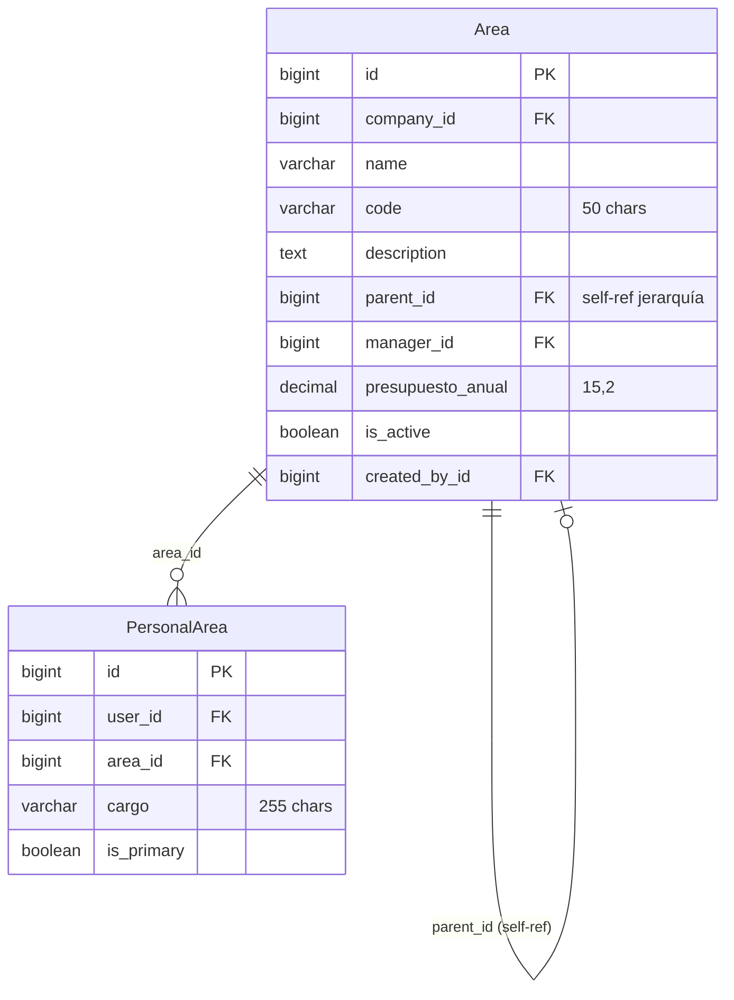

**Relaciones externas:**

| Tabla | Campo FK | Referencia |
|-------|----------|------------|
| Area | `company_id` | `Company.id` |
| Area | `manager_id` | `User.id` |
| Area | `parent_id` | `Area.id` (self-ref) |
| PersonalArea | `user_id` | `User.id` |

**Constraints:** `(company, code)` UK, `(user, area)` UK

---

## 6. Clasificador por Objeto del Gasto (COG)

Catálogo presupuestario mexicano con jerarquía de 4 niveles.

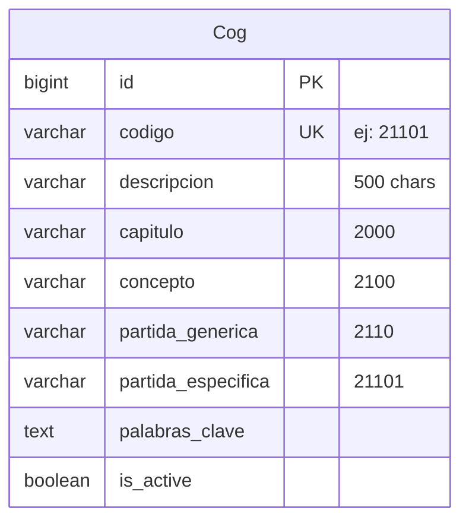

**Jerarquía del COG:**

```
Capítulo 2000 — Materiales y Suministros
  └─ Concepto 2100 — Materiales de Administración
       └─ PG 2110 — Materiales de Oficina
            ├─ PE 21101 — Papelería
            └─ PE 21102 — Útiles de Oficina
       └─ PG 2160 — Material de Cómputo
            ├─ PE 21601 — Consumibles de Cómputo
            └─ PE 21602 — Tóner y Cartuchos
```

**Relaciones externas (COG es referenciado por):**

| Tabla | Campo FK | Uso |
|-------|----------|-----|
| DetalleMaterial | `cog_id` | Clasifica ítem de solicitud |
| ProductoProveedor | `cog_id` | Clasifica producto del proveedor |

---

## 7. Flujo de Procuración

Flujo completo: **Solicitud de Material → Cotización → Autorización Presupuestal → Orden de Compra**

```mermaid
erDiagram
    Cog ||--o{ DetalleMaterial : "cog_id"
    SolicitudMaterial ||--o{ DetalleMaterial : "solicitud_id"
    SolicitudMaterial ||--o{ CotizacionMaterial : "solicitud_id"
    CotizacionMaterial ||--o{ CotizacionDetalle : "cotizacion_id"
    DetalleMaterial ||--o{ CotizacionDetalle : "detalle_material_id"
    SolicitudMaterial ||--o{ SolicitudAutorizacion : "solicitud_id"
    CotizacionMaterial ||--o{ SolicitudAutorizacion : "cotizacion_id"
    SolicitudAutorizacion ||--|| AutorizacionPresupuestal : "solicitud_autorizacion_id"
    CotizacionMaterial ||--o{ OrdenCompra : "cotizacion_id"
    AutorizacionPresupuestal ||--o{ OrdenCompra : "autorizacion_id"
    OrdenCompra ||--o{ DetalleOrden : "orden_id"
    DetalleMaterial ||--o{ DetalleOrden : "detalle_material_id"

    SolicitudMaterial {
        bigint id PK
        bigint area_id FK
        varchar numero UK "SOL-YYYY-NNNNN"
        date fecha_solicitud
        text descripcion
        text justificacion
        text eje_rector
        text programa_presupuestario
        text actividad
        varchar estado "13 estados"
        decimal total_estimado "15,2"
        boolean urgente
        date fecha_requerida
        bigint created_by_id FK
    }

    DetalleMaterial {
        bigint id PK
        bigint solicitud_id FK
        bigint cog_id FK
        varchar concepto "500 chars"
        text descripcion
        decimal cantidad "15,4"
        varchar unidad
        decimal precio_estimado "15,2"
        text notas
    }

    CotizacionMaterial {
        bigint id PK
        bigint solicitud_id FK
        bigint proveedor_id FK
        varchar numero UK "COT-YYYY-NNNNN"
        date fecha
        date vigencia
        decimal subtotal "15,2"
        decimal iva "15,2"
        decimal total "15,2"
        varchar tiempo_entrega "100 chars"
        text condiciones_pago
        text notas
        varchar estado "pendiente|recibida|seleccionada|rechazada"
        varchar documento "PDF"
    }

    CotizacionDetalle {
        bigint id PK
        bigint cotizacion_id FK
        bigint detalle_material_id FK
        varchar concepto
        text descripcion
        decimal cantidad "15,4"
        varchar unidad
        decimal precio_unitario "15,2"
        decimal subtotal "15,2"
    }

    SolicitudAutorizacion {
        bigint id PK
        bigint solicitud_id FK
        bigint cotizacion_id FK
        varchar numero UK "AUT-YYYY-NNNNN"
        date fecha_solicitud
        decimal monto_solicitado "15,2"
        text justificacion
        varchar estado "pendiente|aprobada|rechazada"
        text motivo_rechazo
        bigint solicitante_id FK
    }

    AutorizacionPresupuestal {
        bigint id PK
        bigint solicitud_autorizacion_id FK "OneToOne"
        decimal monto_autorizado "15,2"
        varchar partida_presupuestal "100 chars"
        date fecha_aprobacion
        text observaciones
        bigint aprobado_por_id FK
    }

    OrdenCompra {
        bigint id PK
        bigint proveedor_id FK
        bigint autorizacion_id FK
        bigint cotizacion_id FK
        varchar numero UK "OC-YYYY-NNNNN"
        date fecha_emision
        date fecha_entrega_esperada
        decimal subtotal "15,2"
        decimal iva "15,2"
        decimal total "15,2"
        text condiciones_pago
        text lugar_entrega
        text notas
        varchar estado "borrador|enviada|confirmada|parcial|entregada|cancelada"
        varchar referencia_externa "100 chars"
        bigint created_by_id FK
    }

    DetalleOrden {
        bigint id PK
        bigint orden_id FK
        bigint detalle_material_id FK
        varchar concepto
        text descripcion
        decimal cantidad "15,4"
        varchar unidad
        decimal precio_unitario "15,2"
        decimal subtotal "15,2"
        decimal cantidad_recibida "15,4"
    }
```

**Relaciones externas:**

| Tabla | Campo FK | Referencia |
|-------|----------|------------|
| SolicitudMaterial | `area_id` | `Area.id` |
| SolicitudMaterial | `created_by_id` | `User.id` |
| CotizacionMaterial | `proveedor_id` | `Proveedor.id` |
| SolicitudAutorizacion | `solicitante_id` | `User.id` |
| AutorizacionPresupuestal | `aprobado_por_id` | `User.id` |
| OrdenCompra | `proveedor_id` | `Proveedor.id` |
| OrdenCompra | `created_by_id` | `User.id` |

---

## 8. Inventario

Recepción de bienes contra órdenes de compra y salidas de almacén a áreas.

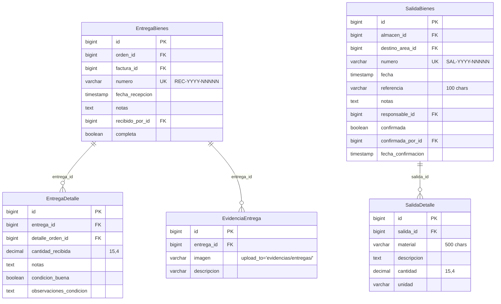

**Relaciones externas:**

| Tabla | Campo FK | Referencia |
|-------|----------|------------|
| EntregaBienes | `orden_id` | `OrdenCompra.id` |
| EntregaBienes | `factura_id` | `Factura.id` |
| EntregaBienes | `recibido_por_id` | `User.id` |
| EntregaDetalle | `detalle_orden_id` | `DetalleOrden.id` |
| SalidaBienes | `almacen_id` | `Area.id` (origen) |
| SalidaBienes | `destino_area_id` | `Area.id` (destino) |
| SalidaBienes | `responsable_id` | `User.id` |
| SalidaBienes | `confirmada_por_id` | `User.id` |

---

## 9. Facturación CFDI 4.0

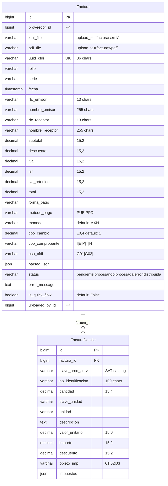

**Relaciones externas:**

| Tabla | Campo FK | Referencia |
|-------|----------|------------|
| Factura | `proveedor_id` | `Proveedor.id` (opcional, auto-detectado por RFC) |
| Factura | `uploaded_by_id` | `User.id` |
| EntregaBienes | `factura_id` | `Factura.id` (vincula recepción con factura) |

---

## 10. Distribución de Gastos

Asigna el costo de cada concepto de factura a las áreas que lo consumieron.

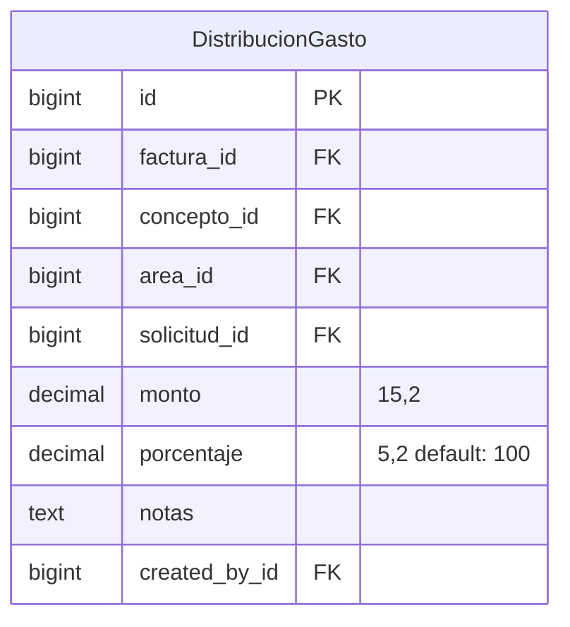

**Relaciones externas:**

| Campo FK | Referencia |
|----------|------------|
| `factura_id` | `Factura.id` |
| `concepto_id` | `FacturaDetalle.id` (concepto específico de la factura) |
| `area_id` | `Area.id` (área que recibe el costo) |
| `solicitud_id` | `SolicitudMaterial.id` (opcional, referencia de origen) |
| `created_by_id` | `User.id` |

---

## 11. Tesorería y Presupuestos

### Tesorería

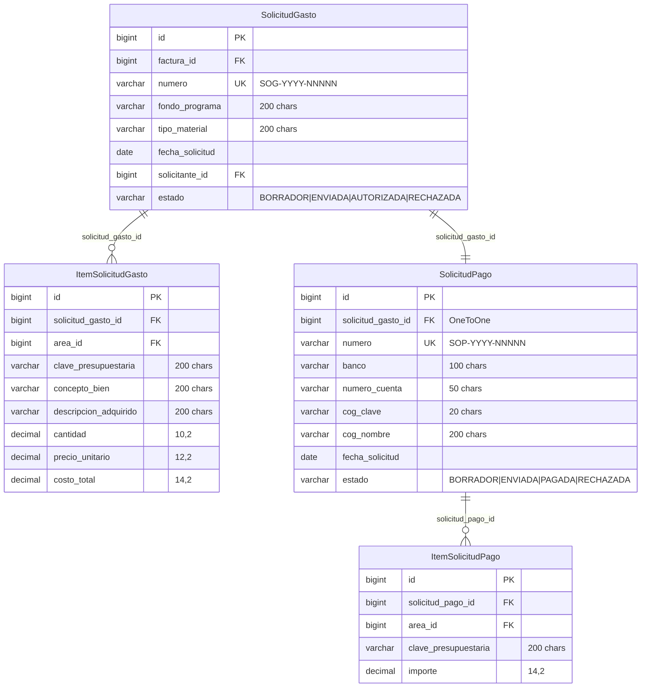

### Presupuestos

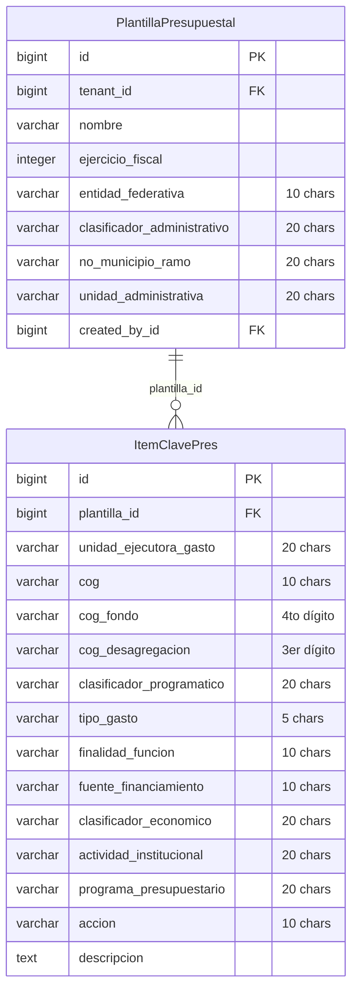

**Relaciones externas:**

| Tabla | Campo FK | Referencia |
|-------|----------|------------|
| SolicitudGasto | `factura_id` | `Factura.id` |
| SolicitudGasto | `solicitante_id` | `User.id` |
| ItemSolicitudGasto | `area_id` | `Area.id` |
| ItemSolicitudPago | `area_id` | `Area.id` |
| PlantillaPresupuestal | `tenant_id` | `Tenant.id` |
| PlantillaPresupuestal | `created_by_id` | `User.id` |

**Constraint:** `(tenant, nombre, ejercicio_fiscal)` UK en PlantillaPresupuestal.

---

## 12. Documentos, Media y Auditoría

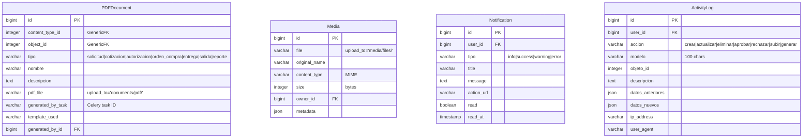

**Relaciones externas:**

| Tabla | Campo FK | Referencia |
|-------|----------|------------|
| PDFDocument | `generated_by_id` | `User.id` |
| Media | `owner_id` | `User.id` |
| Notification | `user_id` | `User.id` |
| ActivityLog | `user_id` | `User.id` |

**Nota sobre PDFDocument:** Usa `GenericForeignKey` de Django (`content_type_id` + `object_id`) para vincularse a cualquier entidad: SolicitudMaterial, CotizacionMaterial, OrdenCompra, EntregaBienes, etc. Los PDFs se generan asíncronamente vía Celery + WeasyPrint.

---

## 13. Índices y Optimización

### Índices por Aplicación

| App | Tabla | Índices |
|-----|-------|---------|
| accounts | User | `email` UK, `role_id`, `is_active` |
| companies | Proveedor | `rfc` UK, `user_id` UK, `estado`, `contacto_email` |
| companies | ProductoProveedor | `(proveedor, nombre, unidad)` UK |
| companies | FirmanteDocumento | `(company, tipo_documento, orden)` UK |
| areas | Area | `(company, code)` UK, `parent_id` |
| areas | PersonalArea | `(user, area)` UK |
| procurement | Cog | `codigo` UK |
| procurement | SolicitudMaterial | `numero` UK, `estado`, `area_id`, `created_by_id` |
| procurement | DetalleMaterial | `solicitud_id`, `cog_id` |
| quotations | CotizacionMaterial | `numero` UK, `solicitud_id`, `proveedor_id`, `estado` |
| orders | OrdenCompra | `numero` UK, `proveedor_id`, `estado`, `fecha_emision` |
| orders | SolicitudAutorizacion | `numero` UK, `solicitud_id` |
| orders | AutorizacionPresupuestal | `solicitud_autorizacion_id` UK |
| inventory | EntregaBienes | `numero` UK, `orden_id`, `fecha_recepcion` |
| inventory | SalidaBienes | `numero` UK, `almacen_id`, `destino_area_id` |
| invoices | Factura | `uuid_cfdi` UK, `proveedor_id`, `rfc_emisor`, `status`, `fecha` |
| invoices | DistribucionGasto | `factura_id`, `area_id`, `concepto_id` |
| treasury | SolicitudGasto | `numero` UK, `factura_id` |
| treasury | SolicitudPago | `numero` UK, `solicitud_gasto_id` UK |
| budget | PlantillaPresupuestal | `(tenant, nombre, ejercicio_fiscal)` UK |
| notifications | Notification | `user_id`, `read`, `created_at` |
| notifications | ActivityLog | `user_id`, `modelo`, `created_at` |

### Índices Compuestos Recomendados

```sql
-- Dashboard: solicitudes por estado y fecha
CREATE INDEX idx_sol_estado_fecha
ON procurement_solicitudmaterial(estado, created_at DESC);

-- Órdenes pendientes de entrega
CREATE INDEX idx_orden_pendiente
ON orders_ordencompra(estado, proveedor_id)
WHERE estado IN ('enviada', 'confirmada', 'parcial');

-- Facturas por procesar
CREATE INDEX idx_factura_pendiente
ON invoices_factura(status, fecha)
WHERE status = 'pendiente';

-- Distribuciones por área (reportes financieros)
CREATE INDEX idx_dist_area_monto
ON invoices_distribuciongasto(area_id, monto);

-- Búsqueda full-text: proveedores
CREATE INDEX idx_proveedor_search
ON companies_proveedor
USING gin(to_tsvector('spanish', razon_social || ' ' || rfc));

-- Búsqueda full-text: COG
CREATE INDEX idx_cog_search
ON procurement_cog
USING gin(to_tsvector('spanish', descripcion || ' ' || palabras_clave));
```

---

## 14. Migraciones y Backup

### Comandos Django

```bash
# Windows PowerShell (desde backend/)
python manage.py makemigrations <app_name>
python manage.py sqlmigrate <app_name> <migration_number>
python manage.py migrate
python manage.py migrate_schemas       # django-tenants: replica en todos los tenants
python manage.py showmigrations

# Crear tenant
python manage.py create_tenant --schema_name=org_001 --name="Organización" --domain=org.midominio.com
```

### Backup PostgreSQL (Producción)

```bash
# Backup completo (todos los esquemas)
pg_dump -h $DB_HOST -U $DB_USER -d $DB_NAME -F c -f backup_$(date +%Y%m%d).dump

# Backup de un tenant específico
pg_dump -h $DB_HOST -U $DB_USER -d $DB_NAME -n schema_001 -F c -f tenant_001.dump

# Restore
pg_restore -h $DB_HOST -U $DB_USER -d $DB_NAME -c backup_20260505.dump
```

### Backup SQLite (Desarrollo)

```powershell
Copy-Item -LiteralPath "db.sqlite3" -Destination "db_backup_$(Get-Date -Format 'yyyyMMdd').sqlite3"
```

---

*Última actualización: mayo 2026 — 38 entidades, 13 apps Django, PostgreSQL 15+ con django-tenants.*
