# Diseño de Base de Datos — Gastos Distribuidos v2

Documento de diseño de la base de datos con diagramas del modelo de datos,
flujos de estados y arquitectura del sistema.

---

## Tabla de Contenidos

1. [Arquitectura de Sistema (C4)](#1-arquitectura-de-sistema-c4)
2. [Multi-tenancy](#2-multi-tenancy)
3. [ERD Completo del Flujo de Procuración](#3-erd-completo-del-flujo-de-procuración)
4. [Usuarios, Roles y Permisos](#4-usuarios-roles-y-permisos)
5. [Módulo de Áreas y Personal](#5-módulo-de-áreas-y-personal)
6. [Proveedores y Catálogo de Productos](#6-proveedores-y-catálogo-de-productos)
7. [Clasificador por Objeto del Gasto (COG)](#7-clasificador-por-objeto-del-gasto-cog)
8. [Flujo de Estados: Solicitud de Material](#8-flujo-de-estados-solicitud-de-material)
9. [Módulo de Cotizaciones](#9-módulo-de-cotizaciones)
10. [Módulo de Autorización y Órdenes de Compra](#10-módulo-de-autorización-y-órdenes-de-compra)
11. [Módulo de Inventario (Entregas y Salidas)](#11-módulo-de-inventario-entregas-y-salidas)
12. [Módulo de Facturación CFDI 4.0](#12-módulo-de-facturación-cfdi-40)
13. [Distribución de Gastos](#13-distribución-de-gastos)
14. [Módulo de Tesorería](#14-módulo-de-tesorería)
15. [Módulo de Presupuestos](#15-módulo-de-presupuestos)
16. [Sistema de Documentos y Notificaciones](#16-sistema-de-documentos-y-notificaciones)
17. [Stack Tecnológico](#17-stack-tecnológico)

---

## 1. Arquitectura de Sistema (C4)

### Diagrama de Contexto (Nivel 1)

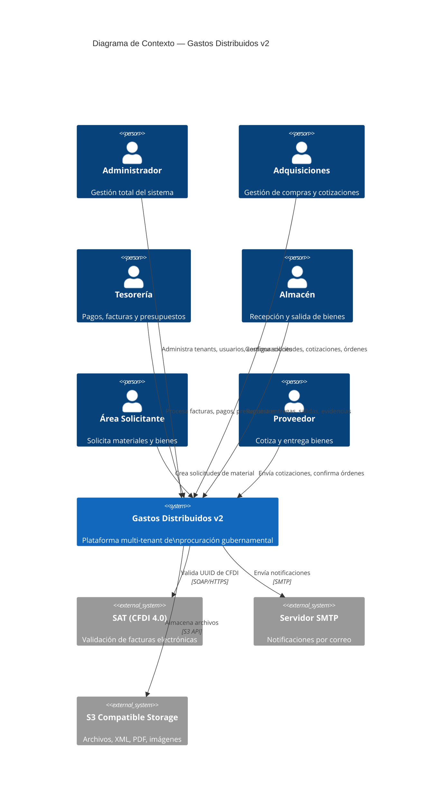
```mermaid
C4Context
    title Diagrama de Contexto — Gastos Distribuidos v2

    Person(admin, "Administrador", "Gestión total del sistema")
    Person(adquisiciones, "Adquisiciones", "Gestión de compras y cotizaciones")
    Person(tesoreria, "Tesorería", "Pagos, facturas y presupuestos")
    Person(almacen, "Almacén", "Recepción y salida de bienes")
    Person(area, "Área Solicitante", "Solicita materiales y bienes")
    Person(proveedor, "Proveedor", "Cotiza y entrega bienes")

    System(gastos, "Gastos Distribuidos v2", "Plataforma multi-tenant de\nprocuración gubernamental")

    System_Ext(sat, "SAT (CFDI 4.0)", "Validación de facturas electrónicas")
    System_Ext(email, "Servidor SMTP", "Notificaciones por correo")
    System_Ext(s3, "S3 Compatible Storage", "Archivos, XML, PDF, imágenes")

    Rel(admin, gastos, "Administra tenants, usuarios, configuraciones")
    Rel(adquisiciones, gastos, "Gestiona solicitudes, cotizaciones, órdenes")
    Rel(tesoreria, gastos, "Procesa facturas, pagos, presupuestos")
    Rel(almacen, gastos, "Registra entregas, salidas, evidencias")
    Rel(area, gastos, "Crea solicitudes de material")
    Rel(proveedor, gastos, "Envía cotizaciones, confirma órdenes")

    Rel(gastos, sat, "Valida UUID de CFDI", "SOAP/HTTPS")
    Rel(gastos, email, "Envía notificaciones", "SMTP")
    Rel(gastos, s3, "Almacena archivos", "S3 API")

    UpdateLayoutConfig($c4ShapeInRow="3", $c4BoundaryInRow="1")
```

### Diagrama de Contenedores (Nivel 2)

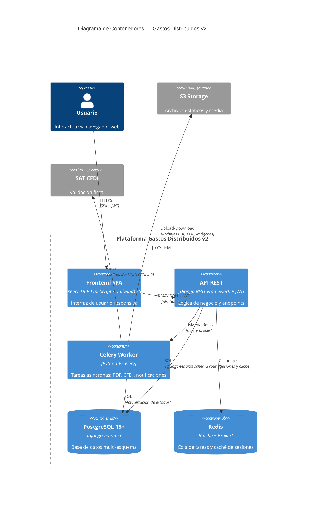
```mermaid
C4Container
    title Diagrama de Contenedores — Gastos Distribuidos v2

    Person(usuario, "Usuario", "Interactúa vía navegador web")

    System_Boundary(sistema, "Plataforma Gastos Distribuidos v2") {
        Container(react, "Frontend SPA", "React 18 + TypeScript + TailwindCSS", "Interfaz de usuario responsiva")
        Container(api, "API REST", "Django REST Framework + JWT", "Lógica de negocio y endpoints")
        Container(worker, "Celery Worker", "Python + Celery", "Tareas asíncronas: PDF, CFDI, notificaciones")
        ContainerDb(postgres, "PostgreSQL 15+", "django-tenants", "Base de datos multi-esquema")
        ContainerDb(redis, "Redis", "Cache + Broker", "Cola de tareas y caché de sesiones")
    }

    System_Ext(s3, "S3 Storage", "Archivos estáticos y media")
    System_Ext(sat, "SAT CFDI", "Validación fiscal")

    Rel(usuario, react, "HTTPS", "SPA + JWT")
    Rel(react, api, "REST/JSON + JWT", "API Gateway")
    Rel(api, postgres, "SQL", "django-tenants schema routing")
    Rel(api, redis, "Cache ops", "Sesiones y caché")
    Rel(api, worker, "Tasks vía Redis", "Celery broker")
    Rel(worker, postgres, "SQL", "Actualización de estados")
    Rel(worker, s3, "Upload/Download", "Archivos PDF, XML, imágenes")
    Rel(worker, sat, "SOAP", "Validación UUID CFDI 4.0")

    UpdateLayoutConfig($c4ShapeInRow="3", $c4BoundaryInRow="1")
```

---

## 2. Multi-tenancy

El sistema usa **django-tenants** con arquitectura de **esquema por tenant** en PostgreSQL.

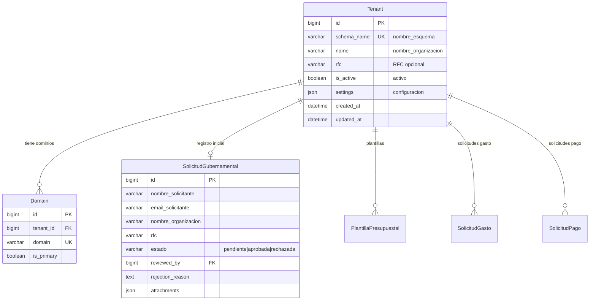
```mermaid
erDiagram
    Tenant ||--o{ Domain : "tiene dominios"
    Tenant ||--o| SolicitudGubernamental : "registro inicial"
    Tenant ||--o{ PlantillaPresupuestal : "plantillas"
    Tenant ||--o{ SolicitudGasto : "solicitudes gasto"
    Tenant ||--o{ SolicitudPago : "solicitudes pago"

    Tenant {
        bigint id PK
        varchar schema_name UK "nombre_esquema"
        varchar name "nombre_organizacion"
        varchar rfc "RFC opcional"
        boolean is_active "activo"
        json settings "configuracion"
        datetime created_at
        datetime updated_at
    }

    Domain {
        bigint id PK
        bigint tenant_id FK
        varchar domain UK
        boolean is_primary
    }

    SolicitudGubernamental {
        bigint id PK
        varchar nombre_solicitante
        varchar email_solicitante
        varchar nombre_organizacion
        varchar rfc
        varchar estado "pendiente|aprobada|rechazada"
        bigint reviewed_by FK
        text rejection_reason
        json attachments
    }
```

### Estrategia de Aislamiento

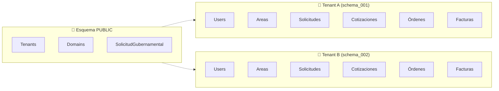
```mermaid
flowchart LR
    subgraph Public["🧩 Esquema PUBLIC"]
        direction TB
        T[Tenants]
        D[Domains]
        SG[SolicitudGubernamental]
    end

    subgraph T1["🏢 Tenant A (schema_001)"]
        direction TB
        U1[Users]
        A1[Areas]
        S1[Solicitudes]
        C1[Cotizaciones]
        O1[Órdenes]
        F1[Facturas]
    end

    subgraph T2["🏢 Tenant B (schema_002)"]
        direction TB
        U2[Users]
        A2[Areas]
        S2[Solicitudes]
        C2[Cotizaciones]
        O2[Órdenes]
        F2[Facturas]
    end

    Public -.-> T1
    Public -.-> T2
```

Todos los datos de negocio residen en esquemas separados por tenant. El esquema `public` solo contiene la tabla de tenants, dominios y solicitudes de registro. Cada tenant tiene su propio conjunto completo de tablas mediante Django migrations multi-schema.

---

## 3. ERD Completo del Flujo de Procuración

Diagrama entidad-relación del flujo completo de procuración, desde la solicitud hasta la distribución del gasto.

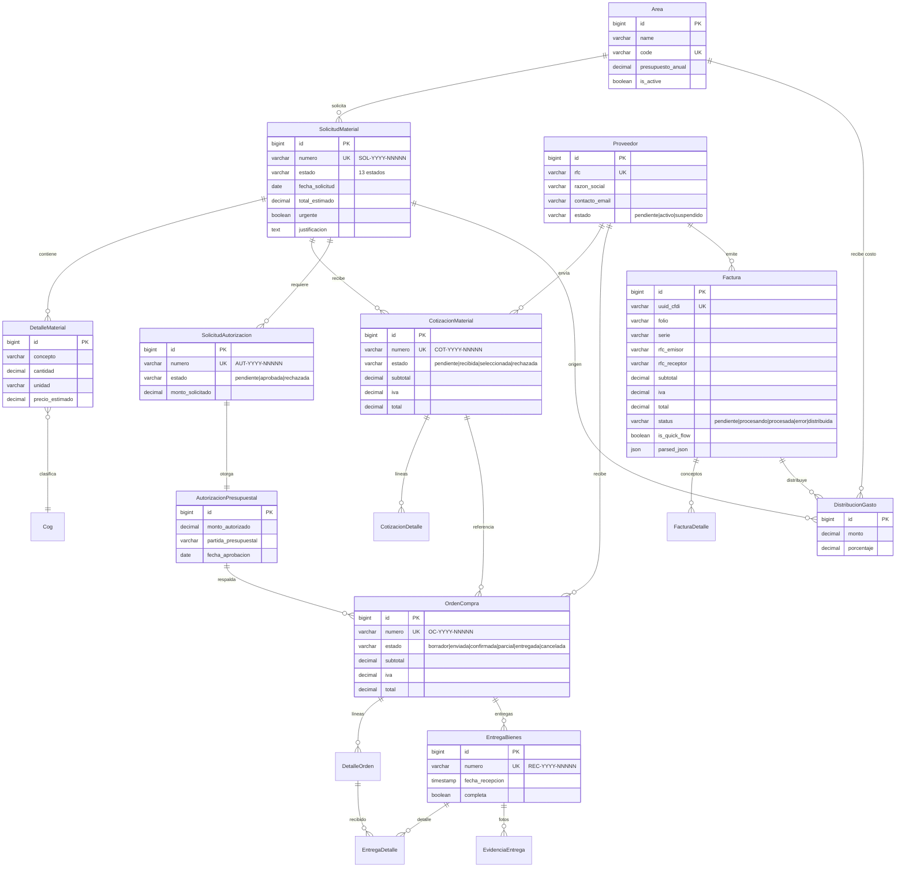
```mermaid
erDiagram
    %% Core Flow
    Area ||--o{ SolicitudMaterial : "solicita"
    SolicitudMaterial ||--o{ DetalleMaterial : "contiene"
    DetalleMaterial }o--|| Cog : "clasifica"
    SolicitudMaterial ||--o{ CotizacionMaterial : "recibe"
    Proveedor ||--o{ CotizacionMaterial : "envía"
    CotizacionMaterial ||--o{ CotizacionDetalle : "líneas"
    SolicitudMaterial ||--o{ SolicitudAutorizacion : "requiere"
    SolicitudAutorizacion ||--|| AutorizacionPresupuestal : "otorga"
    Proveedor ||--o{ OrdenCompra : "recibe"
    OrdenCompra ||--o{ DetalleOrden : "líneas"
    CotizacionMaterial ||--o{ OrdenCompra : "referencia"
    AutorizacionPresupuestal ||--o{ OrdenCompra : "respalda"
    OrdenCompra ||--o{ EntregaBienes : "entregas"
    EntregaBienes ||--o{ EntregaDetalle : "detalle"
    DetalleOrden ||--o{ EntregaDetalle : "recibido"
    EntregaBienes ||--o{ EvidenciaEntrega : "fotos"
    Proveedor ||--o{ Factura : "emite"
    Factura ||--o{ FacturaDetalle : "conceptos"
    Factura ||--o{ DistribucionGasto : "distribuye"
    Area ||--o{ DistribucionGasto : "recibe costo"
    SolicitudMaterial ||--o{ DistribucionGasto : "origen"

    %% Entities with key fields
    Area {
        bigint id PK
        varchar name
        varchar code UK
        decimal presupuesto_anual
        boolean is_active
    }

    SolicitudMaterial {
        bigint id PK
        varchar numero UK "SOL-YYYY-NNNNN"
        varchar estado "13 estados"
        date fecha_solicitud
        decimal total_estimado
        boolean urgente
        text justificacion
    }

    DetalleMaterial {
        bigint id PK
        varchar concepto
        decimal cantidad
        varchar unidad
        decimal precio_estimado
    }

    CotizacionMaterial {
        bigint id PK
        varchar numero UK "COT-YYYY-NNNNN"
        varchar estado "pendiente|recibida|seleccionada|rechazada"
        decimal subtotal
        decimal iva
        decimal total
    }

    SolicitudAutorizacion {
        bigint id PK
        varchar numero UK "AUT-YYYY-NNNNN"
        varchar estado "pendiente|aprobada|rechazada"
        decimal monto_solicitado
    }

    AutorizacionPresupuestal {
        bigint id PK
        decimal monto_autorizado
        varchar partida_presupuestal
        date fecha_aprobacion
    }

    OrdenCompra {
        bigint id PK
        varchar numero UK "OC-YYYY-NNNNN"
        varchar estado "borrador|enviada|confirmada|parcial|entregada|cancelada"
        decimal subtotal
        decimal iva
        decimal total
    }

    EntregaBienes {
        bigint id PK
        varchar numero UK "REC-YYYY-NNNNN"
        timestamp fecha_recepcion
        boolean completa
    }

    Factura {
        bigint id PK
        varchar uuid_cfdi UK
        varchar folio
        varchar serie
        varchar rfc_emisor
        varchar rfc_receptor
        decimal subtotal
        decimal iva
        decimal total
        varchar status "pendiente|procesando|procesada|error|distribuida"
        boolean is_quick_flow
        json parsed_json
    }

    DistribucionGasto {
        bigint id PK
        decimal monto
        decimal porcentaje
    }

    Proveedor {
        bigint id PK
        varchar rfc UK
        varchar razon_social
        varchar contacto_email
        varchar estado "pendiente|activo|suspendido"
    }
```

### Navegabilidad por Numeración

Cada documento tiene un formato de número único autogenerado:
| Documento | Prefijo | Formato | Ejemplo |
|-----------|---------|---------|---------|
| Solicitud de Material | `SOL` | SOL-YYYY-NNNNN | SOL-2026-00042 |
| Cotización | `COT` | COT-YYYY-NNNNN | COT-2026-00015 |
| Solicitud de Autorización | `AUT` | AUT-YYYY-NNNNN | AUT-2026-00008 |
| Orden de Compra | `OC` | OC-YYYY-NNNNN | OC-2026-00023 |
| Entrega/Recepción | `REC` | REC-YYYY-NNNNN | REC-2026-00031 |
| Salida de Bienes | `SAL` | SAL-YYYY-NNNNN | SAL-2026-00007 |
| Solicitud de Gasto | `SOG` | SOG-YYYY-NNNNN | SOG-2026-00019 |
| Solicitud de Pago | `SOP` | SOP-YYYY-NNNNN | SOP-2026-00011 |

---

## 4. Usuarios, Roles y Permisos

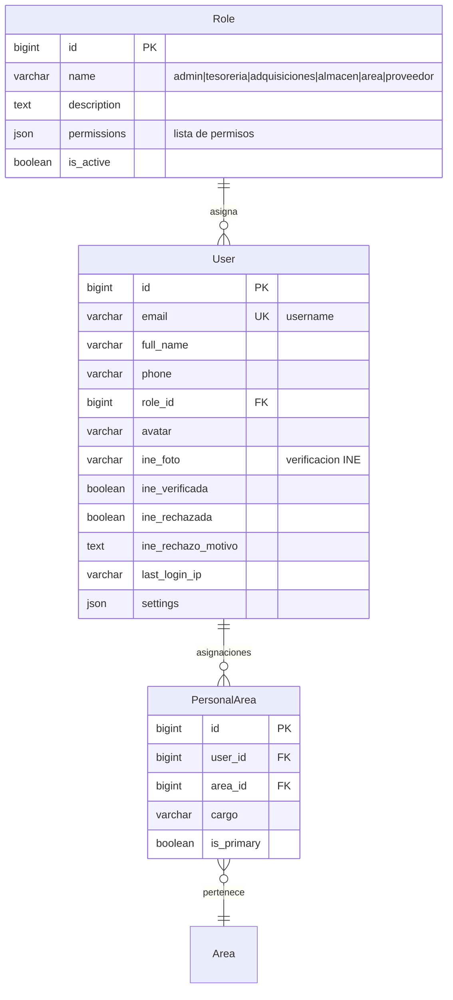
```mermaid
erDiagram
    Role ||--o{ User : "asigna"
    User ||--o{ PersonalArea : "asignaciones"
    PersonalArea }o--|| Area : "pertenece"

    Role {
        bigint id PK
        varchar name "admin|tesoreria|adquisiciones|almacen|area|proveedor"
        text description
        json permissions "lista de permisos"
        boolean is_active
    }

    User {
        bigint id PK
        varchar email UK "username"
        varchar full_name
        varchar phone
        bigint role_id FK
        varchar avatar
        varchar ine_foto "verificacion INE"
        boolean ine_verificada
        boolean ine_rechazada
        text ine_rechazo_motivo
        varchar last_login_ip
        json settings
    }

    PersonalArea {
        bigint id PK
        bigint user_id FK
        bigint area_id FK
        varchar cargo
        boolean is_primary
    }
```

### Matriz de Roles y Permisos

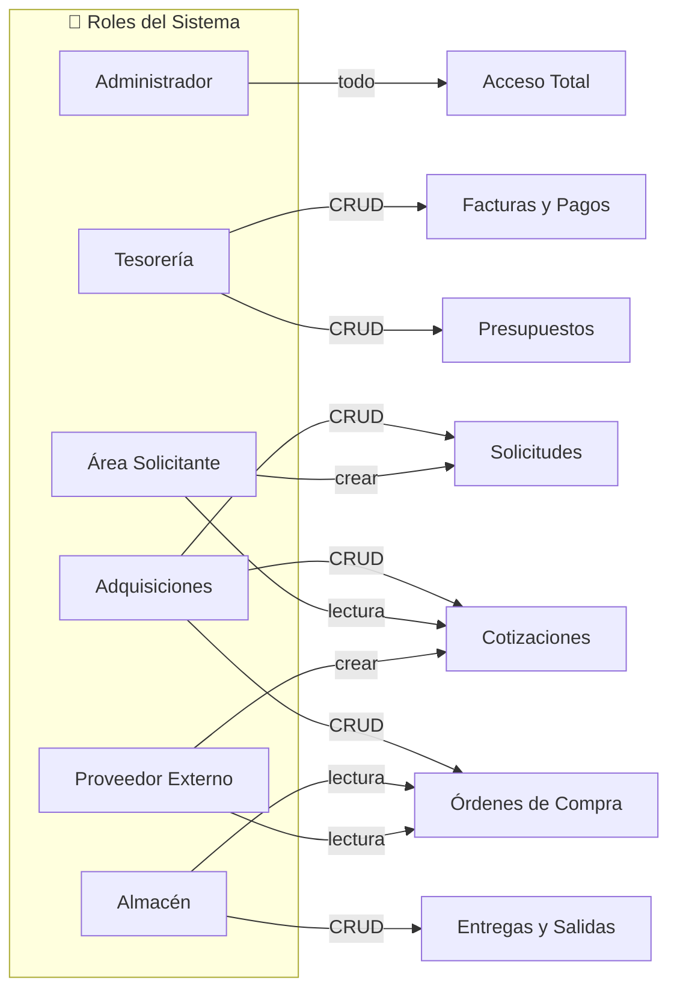
```mermaid
flowchart LR
    subgraph Roles["👥 Roles del Sistema"]
        Admin[Administrador]
        Tesoreria[Tesorería]
        Adquisiciones[Adquisiciones]
        Almacen[Almacén]
        Area[Área Solicitante]
        Proveedor[Proveedor Externo]
    end

    Admin -->|"todo"| FULL[Acceso Total]
    Tesoreria -->|"CRUD"| Pagos[Facturas y Pagos]
    Tesoreria -->|"CRUD"| Presup[Presupuestos]
    Adquisiciones -->|"CRUD"| Solicitudes[Solicitudes]
    Adquisiciones -->|"CRUD"| Cotiz[Cotizaciones]
    Adquisiciones -->|"CRUD"| Ordenes[Órdenes de Compra]
    Almacen -->|"CRUD"| Entregas[Entregas y Salidas]
    Almacen -->|"lectura"| Ordenes
    Area -->|"crear"| Solicitudes
    Area -->|"lectura"| Cotiz
    Proveedor -->|"crear"| Cotiz
    Proveedor -->|"lectura"| Ordenes
```

---

## 5. Módulo de Áreas y Personal

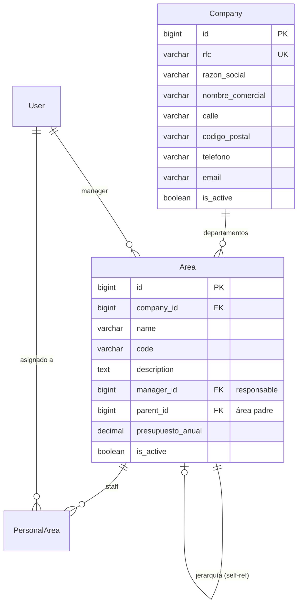
```mermaid
erDiagram
    Company ||--o{ Area : "departamentos"
    Area ||--o| Area : "jerarquía (self-ref)"
    Area ||--o{ PersonalArea : "staff"
    User ||--o{ PersonalArea : "asignado a"
    User ||--o{ Area : "manager"

    Company {
        bigint id PK
        varchar rfc UK
        varchar razon_social
        varchar nombre_comercial
        varchar calle
        varchar codigo_postal
        varchar telefono
        varchar email
        boolean is_active
    }

    Area {
        bigint id PK
        bigint company_id FK
        varchar name
        varchar code
        text description
        bigint manager_id FK "responsable"
        bigint parent_id FK "área padre"
        decimal presupuesto_anual
        boolean is_active
    }
```

Las áreas tienen jerarquía mediante auto-referencia (`parent`), permitiendo estructuras como:

```
Dirección General
├── Dirección de Administración
│   ├── Departamento de Adquisiciones
│   └── Departamento de Recursos Materiales
├── Dirección de Finanzas
│   ├── Departamento de Tesorería
│   └── Departamento de Contabilidad
└── Dirección de Operaciones
    ├── Almacén Central
    └── Área Técnica A
```

---

## 6. Proveedores y Catálogo de Productos

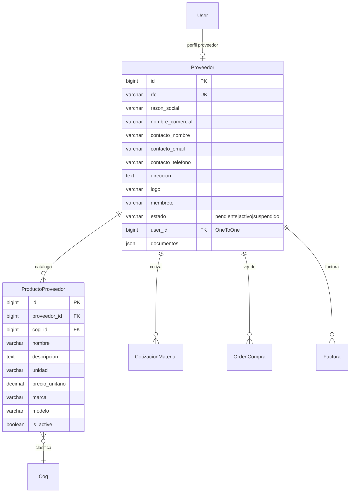
```mermaid
erDiagram
    Proveedor ||--o{ ProductoProveedor : "catálogo"
    ProductoProveedor }o--|| Cog : "clasifica"
    Proveedor ||--o{ CotizacionMaterial : "cotiza"
    Proveedor ||--o{ OrdenCompra : "vende"
    Proveedor ||--o{ Factura : "factura"
    User ||--o| Proveedor : "perfil proveedor"

    Proveedor {
        bigint id PK
        varchar rfc UK
        varchar razon_social
        varchar nombre_comercial
        varchar contacto_nombre
        varchar contacto_email
        varchar contacto_telefono
        text direccion
        varchar logo
        varchar membrete
        varchar estado "pendiente|activo|suspendido"
        bigint user_id FK "OneToOne"
        json documentos
    }

    ProductoProveedor {
        bigint id PK
        bigint proveedor_id FK
        bigint cog_id FK
        varchar nombre
        text descripcion
        varchar unidad
        decimal precio_unitario
        varchar marca
        varchar modelo
        boolean is_active
    }
```

**Restricción de unicidad** en `ProductoProveedor`: `(proveedor, nombre, unidad)` — un proveedor no puede tener el mismo producto con la misma unidad duplicado.

---

## 7. Clasificador por Objeto del Gasto (COG)

El COG es el catálogo de clasificación presupuestaria usado por el gobierno mexicano. Cada partida tiene una jerarquía de 4 niveles.

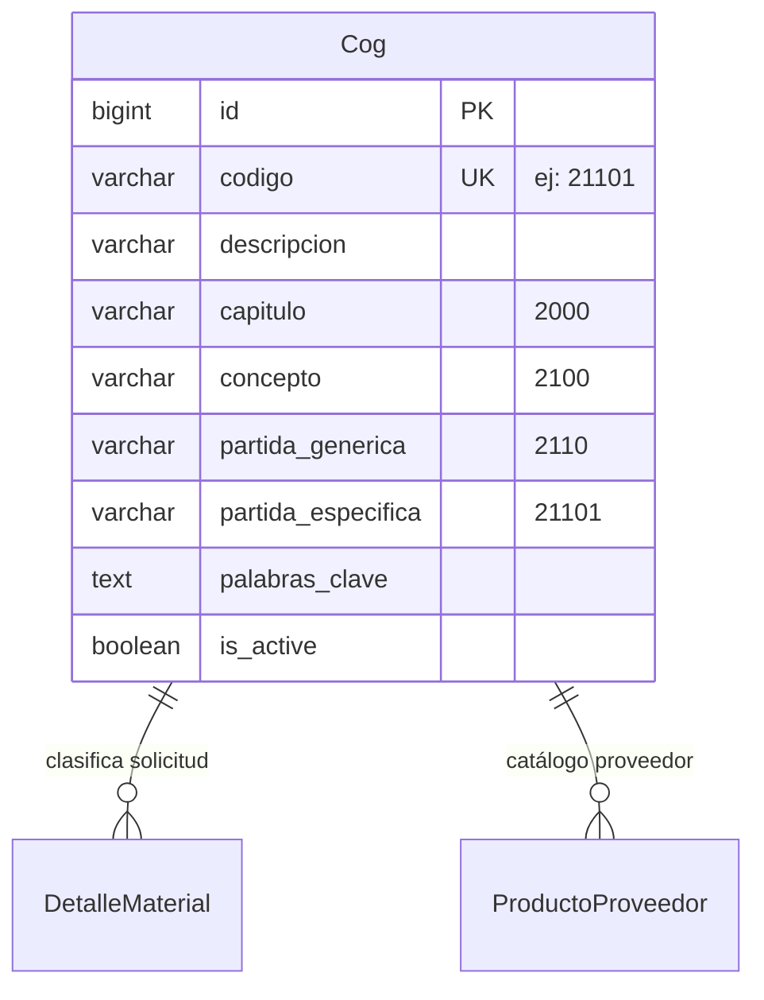
```mermaid
erDiagram
    Cog {
        bigint id PK
        varchar codigo UK "ej: 21101"
        varchar descripcion
        varchar capitulo "2000"
        varchar concepto "2100"
        varchar partida_generica "2110"
        varchar partida_especifica "21101"
        text palabras_clave
        boolean is_active
    }

    Cog ||--o{ DetalleMaterial : "clasifica solicitud"
    Cog ||--o{ ProductoProveedor : "catálogo proveedor"
```

### Estructura Jerárquica del COG

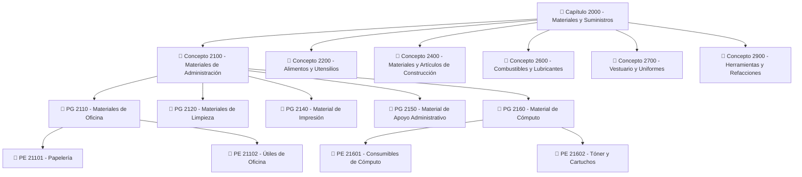
```mermaid
flowchart TD
    CAP["📂 Capítulo 2000 - Materiales y Suministros"] --> CON1["📁 Concepto 2100 - Materiales de Administración"]
    CAP --> CON2["📁 Concepto 2200 - Alimentos y Utensilios"]
    CAP --> CON3["📁 Concepto 2400 - Materiales y Artículos de Construcción"]
    CAP --> CON4["📁 Concepto 2600 - Combustibles y Lubricantes"]
    CAP --> CON5["📁 Concepto 2700 - Vestuario y Uniformes"]
    CAP --> CON6["📁 Concepto 2900 - Herramientas y Refacciones"]

    CON1 --> PG1["📄 PG 2110 - Materiales de Oficina"]
    CON1 --> PG2["📄 PG 2120 - Materiales de Limpieza"]
    CON1 --> PG3["📄 PG 2140 - Material de Impresión"]
    CON1 --> PG4["📄 PG 2150 - Material de Apoyo Administrativo"]
    CON1 --> PG5["📄 PG 2160 - Material de Cómputo"]

    PG1 --> PE1["📝 PE 21101 - Papelería"]
    PG1 --> PE2["📝 PE 21102 - Útiles de Oficina"]
    PG5 --> PE3["📝 PE 21601 - Consumibles de Cómputo"]
    PG5 --> PE4["📝 PE 21602 - Tóner y Cartuchos"]
```

---

## 8. Flujo de Estados: Solicitud de Material

El workflow de estados más complejo del sistema, con 13 estados posibles.

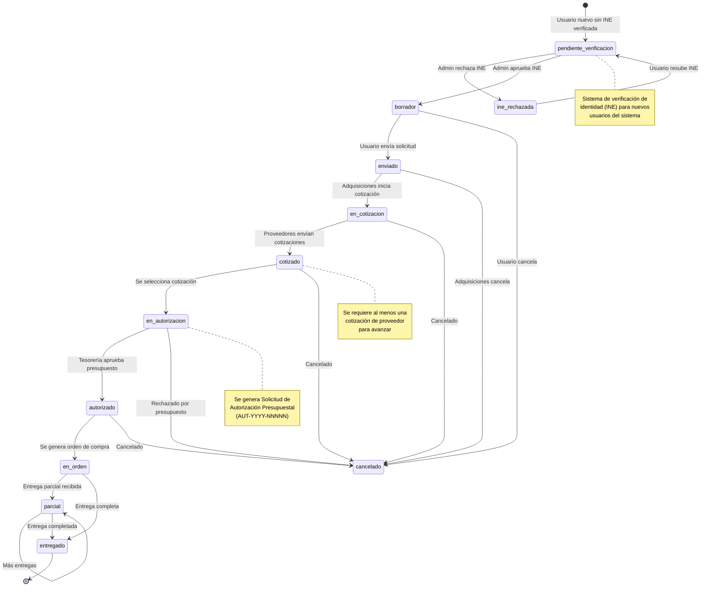
```mermaid
stateDiagram-v2
    [*] --> pendiente_verificacion : Usuario nuevo sin INE verificada

    pendiente_verificacion --> ine_rechazada : Admin rechaza INE
    pendiente_verificacion --> borrador : Admin aprueba INE

    ine_rechazada --> pendiente_verificacion : Usuario resube INE

    borrador --> enviado : Usuario envía solicitud
    borrador --> cancelado : Usuario cancela

    enviado --> en_cotizacion : Adquisiciones inicia cotización
    enviado --> cancelado : Adquisiciones cancela

    en_cotizacion --> cotizado : Proveedores envían cotizaciones
    en_cotizacion --> cancelado : Cancelado

    cotizado --> en_autorizacion : Se selecciona cotización
    cotizado --> cancelado : Cancelado

    en_autorizacion --> autorizado : Tesorería aprueba presupuesto
    en_autorizacion --> cancelado : Rechazado por presupuesto

    autorizado --> en_orden : Se genera orden de compra
    autorizado --> cancelado : Cancelado

    en_orden --> parcial : Entrega parcial recibida
    en_orden --> entregado : Entrega completa

    parcial --> parcial : Más entregas
    parcial --> entregado : Entrega completada

    entregado --> [*]

    note right of pendiente_verificacion
        Sistema de verificación de
        identidad (INE) para nuevos
        usuarios del sistema
    end note

    note right of cotizado
        Se requiere al menos una
        cotización de proveedor
        para avanzar
    end note

    note right of en_autorizacion
        Se genera Solicitud de
        Autorización Presupuestal
        (AUT-YYYY-NNNNN)
    end note
```

---

## 9. Módulo de Cotizaciones

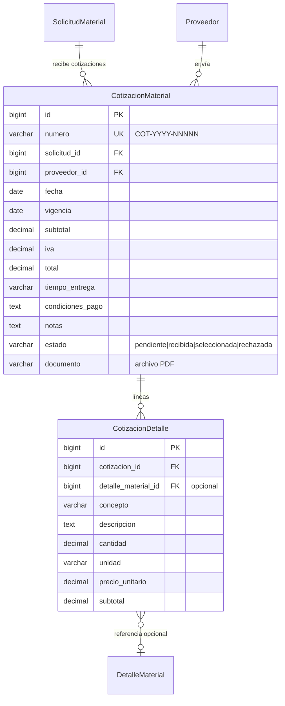
```mermaid
erDiagram
    SolicitudMaterial ||--o{ CotizacionMaterial : "recibe cotizaciones"
    Proveedor ||--o{ CotizacionMaterial : "envía"
    CotizacionMaterial ||--o{ CotizacionDetalle : "líneas"
    CotizacionDetalle }o--o| DetalleMaterial : "referencia opcional"

    CotizacionMaterial {
        bigint id PK
        varchar numero UK "COT-YYYY-NNNNN"
        bigint solicitud_id FK
        bigint proveedor_id FK
        date fecha
        date vigencia
        decimal subtotal
        decimal iva
        decimal total
        varchar tiempo_entrega
        text condiciones_pago
        text notas
        varchar estado "pendiente|recibida|seleccionada|rechazada"
        varchar documento "archivo PDF"
    }

    CotizacionDetalle {
        bigint id PK
        bigint cotizacion_id FK
        bigint detalle_material_id FK "opcional"
        varchar concepto
        text descripcion
        decimal cantidad
        varchar unidad
        decimal precio_unitario
        decimal subtotal
    }
```

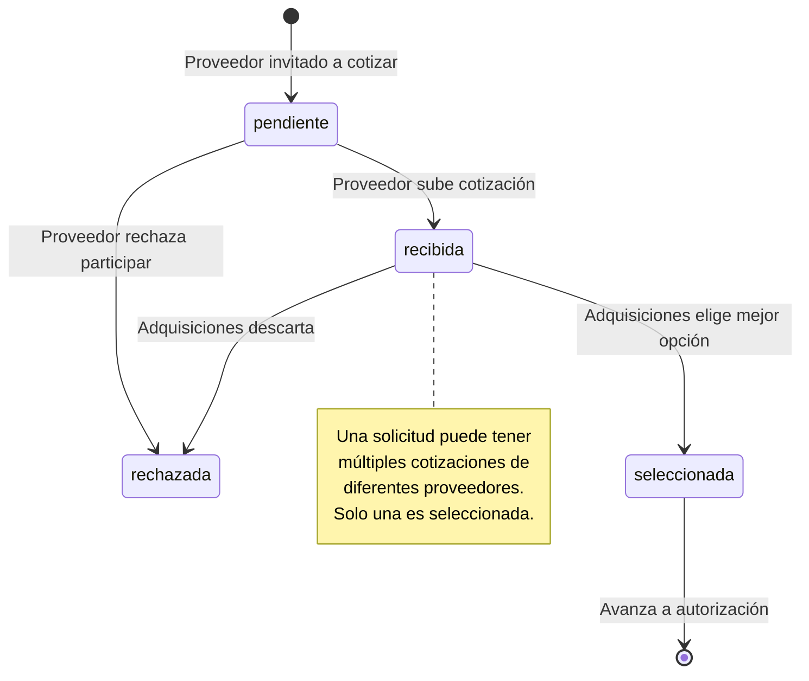
```mermaid
stateDiagram-v2
    [*] --> pendiente : Proveedor invitado a cotizar
    pendiente --> recibida : Proveedor sube cotización
    pendiente --> rechazada : Proveedor rechaza participar

    recibida --> seleccionada : Adquisiciones elige mejor opción
    recibida --> rechazada : Adquisiciones descarta

    seleccionada --> [*] : Avanza a autorización

    note right of recibida
        Una solicitud puede tener
        múltiples cotizaciones de
        diferentes proveedores.
        Solo una es seleccionada.
    end note
```

---

## 10. Módulo de Autorización y Órdenes de Compra

### Sub-flujo de Autorización Presupuestal

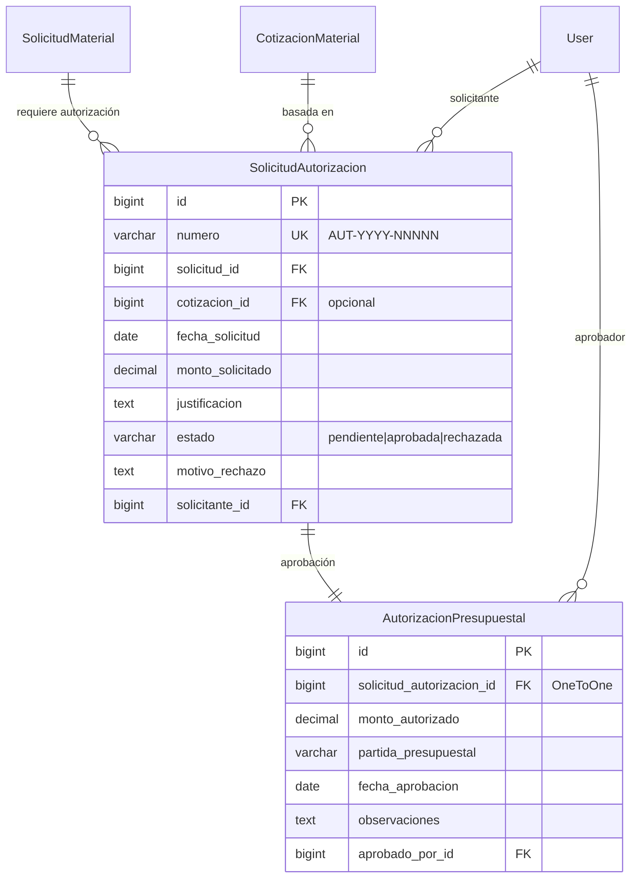
```mermaid
erDiagram
    SolicitudMaterial ||--o{ SolicitudAutorizacion : "requiere autorización"
    SolicitudAutorizacion ||--|| AutorizacionPresupuestal : "aprobación"
    CotizacionMaterial ||--o{ SolicitudAutorizacion : "basada en"
    User ||--o{ SolicitudAutorizacion : "solicitante"
    User ||--o{ AutorizacionPresupuestal : "aprobador"

    SolicitudAutorizacion {
        bigint id PK
        varchar numero UK "AUT-YYYY-NNNNN"
        bigint solicitud_id FK
        bigint cotizacion_id FK "opcional"
        date fecha_solicitud
        decimal monto_solicitado
        text justificacion
        varchar estado "pendiente|aprobada|rechazada"
        text motivo_rechazo
        bigint solicitante_id FK
    }

    AutorizacionPresupuestal {
        bigint id PK
        bigint solicitud_autorizacion_id FK "OneToOne"
        decimal monto_autorizado
        varchar partida_presupuestal
        date fecha_aprobacion
        text observaciones
        bigint aprobado_por_id FK
    }
```

### Órdenes de Compra

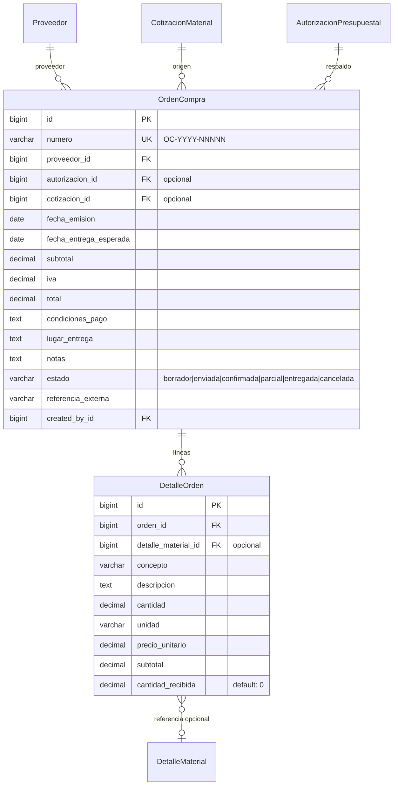
```mermaid
erDiagram
    OrdenCompra ||--o{ DetalleOrden : "líneas"
    DetalleOrden }o--o| DetalleMaterial : "referencia opcional"
    Proveedor ||--o{ OrdenCompra : "proveedor"
    CotizacionMaterial ||--o{ OrdenCompra : "origen"
    AutorizacionPresupuestal ||--o{ OrdenCompra : "respaldo"

    OrdenCompra {
        bigint id PK
        varchar numero UK "OC-YYYY-NNNNN"
        bigint proveedor_id FK
        bigint autorizacion_id FK "opcional"
        bigint cotizacion_id FK "opcional"
        date fecha_emision
        date fecha_entrega_esperada
        decimal subtotal
        decimal iva
        decimal total
        text condiciones_pago
        text lugar_entrega
        text notas
        varchar estado "borrador|enviada|confirmada|parcial|entregada|cancelada"
        varchar referencia_externa
        bigint created_by_id FK
    }

    DetalleOrden {
        bigint id PK
        bigint orden_id FK
        bigint detalle_material_id FK "opcional"
        varchar concepto
        text descripcion
        decimal cantidad
        varchar unidad
        decimal precio_unitario
        decimal subtotal
        decimal cantidad_recibida "default: 0"
    }
```

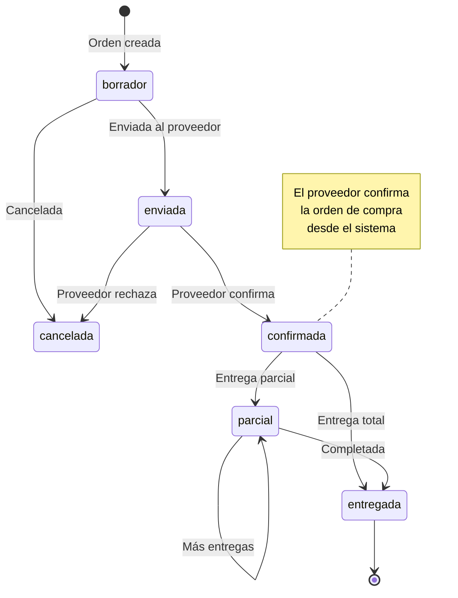
```mermaid
stateDiagram-v2
    [*] --> borrador : Orden creada

    borrador --> enviada : Enviada al proveedor
    borrador --> cancelada : Cancelada

    enviada --> confirmada : Proveedor confirma
    enviada --> cancelada : Proveedor rechaza

    confirmada --> parcial : Entrega parcial
    confirmada --> entregada : Entrega total

    parcial --> parcial : Más entregas
    parcial --> entregada : Completada

    entregada --> [*]

    note left of confirmada
        El proveedor confirma
        la orden de compra
        desde el sistema
    end note
```

---

## 11. Módulo de Inventario (Entregas y Salidas)

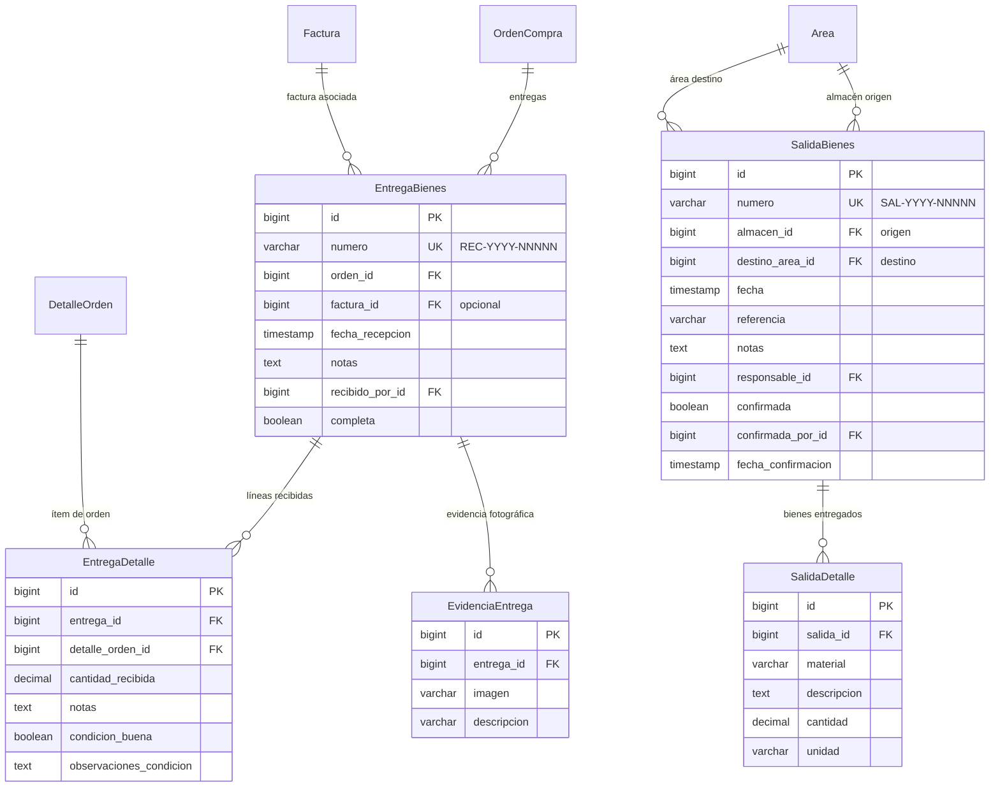
```mermaid
erDiagram
    OrdenCompra ||--o{ EntregaBienes : "entregas"
    EntregaBienes ||--o{ EntregaDetalle : "líneas recibidas"
    DetalleOrden ||--o{ EntregaDetalle : "ítem de orden"
    EntregaBienes ||--o{ EvidenciaEntrega : "evidencia fotográfica"
    Factura ||--o{ EntregaBienes : "factura asociada"

    Area ||--o{ SalidaBienes : "almacén origen"
    Area ||--o{ SalidaBienes : "área destino"
    SalidaBienes ||--o{ SalidaDetalle : "bienes entregados"

    EntregaBienes {
        bigint id PK
        varchar numero UK "REC-YYYY-NNNNN"
        bigint orden_id FK
        bigint factura_id FK "opcional"
        timestamp fecha_recepcion
        text notas
        bigint recibido_por_id FK
        boolean completa
    }

    EntregaDetalle {
        bigint id PK
        bigint entrega_id FK
        bigint detalle_orden_id FK
        decimal cantidad_recibida
        text notas
        boolean condicion_buena
        text observaciones_condicion
    }

    EvidenciaEntrega {
        bigint id PK
        bigint entrega_id FK
        varchar imagen
        varchar descripcion
    }

    SalidaBienes {
        bigint id PK
        varchar numero UK "SAL-YYYY-NNNNN"
        bigint almacen_id FK "origen"
        bigint destino_area_id FK "destino"
        timestamp fecha
        varchar referencia
        text notas
        bigint responsable_id FK
        boolean confirmada
        bigint confirmada_por_id FK
        timestamp fecha_confirmacion
    }

    SalidaDetalle {
        bigint id PK
        bigint salida_id FK
        varchar material
        text descripcion
        decimal cantidad
        varchar unidad
    }
```

### Ciclo de Vida del Inventario

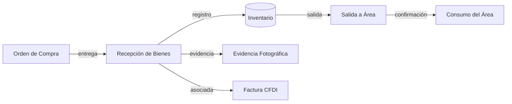
```mermaid
flowchart LR
    OC[Orden de Compra] -->|"entrega"| REC[Recepción de Bienes]
    REC -->|"registro"| STOCK[(Inventario)]
    STOCK -->|"salida"| SAL[Salida a Área]
    SAL -->|"confirmación"| CONSUMO[Consumo del Área]

    REC -->|"evidencia"| FOTO[Evidencia Fotográfica]
    REC -->|"asociada"| FACT[Factura CFDI]
```

---

## 12. Módulo de Facturación CFDI 4.0

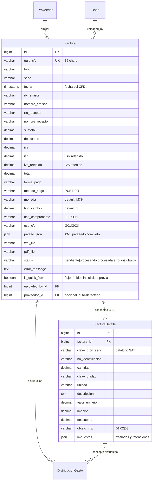
```mermaid
erDiagram
    Factura ||--o{ FacturaDetalle : "conceptos CFDI"
    Proveedor ||--o{ Factura : "emisor"
    User ||--o{ Factura : "uploaded_by"
    Factura ||--o{ DistribucionGasto : "distribución"
    FacturaDetalle ||--o{ DistribucionGasto : "concepto distribuido"

    Factura {
        bigint id PK
        varchar uuid_cfdi UK "36 chars"
        varchar folio
        varchar serie
        timestamp fecha "fecha del CFDI"
        varchar rfc_emisor
        varchar nombre_emisor
        varchar rfc_receptor
        varchar nombre_receptor
        decimal subtotal
        decimal descuento
        decimal iva
        decimal isr "ISR retenido"
        decimal iva_retenido "IVA retenido"
        decimal total
        varchar forma_pago
        varchar metodo_pago "PUE|PPD"
        varchar moneda "default: MXN"
        decimal tipo_cambio "default: 1"
        varchar tipo_comprobante "I|E|P|T|N"
        varchar uso_cfdi "G01|G03|..."
        json parsed_json "XML parseado completo"
        varchar xml_file
        varchar pdf_file
        varchar status "pendiente|procesando|procesada|error|distribuida"
        text error_message
        boolean is_quick_flow "flujo rápido sin solicitud previa"
        bigint uploaded_by_id FK
        bigint proveedor_id FK "opcional, auto-detectado"
    }

    FacturaDetalle {
        bigint id PK
        bigint factura_id FK
        varchar clave_prod_serv "catálogo SAT"
        varchar no_identificacion
        decimal cantidad
        varchar clave_unidad
        varchar unidad
        text descripcion
        decimal valor_unitario
        decimal importe
        decimal descuento
        varchar objeto_imp "01|02|03"
        json impuestos "traslados y retenciones"
    }
```

### Flujo de Procesamiento de CFDI

```mermaid
flowchart TD
    UPLOAD[📤 Subir XML CFDI 4.0] --> PARSE[🔍 Parsear XML con lxml]
    PARSE --> VALIDATE{¿UUID válido?}
    VALIDATE -->|"No"| ERROR[❌ Estado: error]
    VALIDATE -->|"Sí"| EXTRACT[📋 Extraer campos fiscales]

    EXTRACT --> MATCH{¿Flujo rápido?}
    MATCH -->|"Sí (is_quick_flow)"| MANUAL[👤 Asignación manual proveedor/área]
    MATCH -->|"No"| AUTO[🔗 Auto-vincular con Orden de Compra]

    AUTO --> CHECK{¿Proveedor coincide?}
    CHECK -->|"Sí"| LINK[✅ Vincular factura → orden → solicitud]
    CHECK -->|"No"| DETECT[🔄 Auto-detectar por RFC emisor]

    DETECT --> LINK
    MANUAL --> DIST[💰 Distribuir gasto por áreas]

    LINK --> PROCESADA[✅ Estado: procesada]
    PROCESADA --> DIST

    DIST --> FINAL[🏁 Estado: distribuida]
```

---

## 13. Distribución de Gastos

La distribución de gastos es el núcleo financiero del sistema: asigna cada concepto de una factura a las áreas que lo consumieron.

```mermaid
erDiagram
    Factura ||--o{ DistribucionGasto : "distribuye"
    FacturaDetalle ||--o{ DistribucionGasto : "concepto origen"
    Area ||--o{ DistribucionGasto : "recibe el costo"
    SolicitudMaterial ||--o{ DistribucionGasto : "referencia"

    DistribucionGasto {
        bigint id PK
        bigint factura_id FK
        bigint concepto_id FK "FacturaDetalle"
        bigint area_id FK
        bigint solicitud_id FK "opcional"
        decimal monto "importe asignado"
        decimal porcentaje "default: 100"
        text notas
        bigint created_by_id FK
    }
```

### Ejemplo de Distribución

```mermaid
flowchart TD
    FACT["🧾 Factura CFDI\nTotal: $50,000 MXN"] --> C1["📦 Concepto 1: Papelería\nImporte: $30,000"]
    FACT --> C2["📦 Concepto 2: Tóner\nImporte: $20,000"]

    C1 -->|"60% = $18,000"| A1["🏢 Dirección General"]
    C1 -->|"40% = $12,000"| A2["🏢 Recursos Humanos"]

    C2 -->|"100% = $20,000"| A3["🏢 Informática"]

    A1 -->|"COG 21101"| R1["📊 Reporte Presupuestal"]
    A2 -->|"COG 21101"| R1
    A3 -->|"COG 21602"| R1
```

---

## 14. Módulo de Tesorería

```mermaid
erDiagram
    SolicitudGasto ||--|| SolicitudPago : "genera pago"
    SolicitudGasto ||--o{ ItemSolicitudGasto : "ítems"
    SolicitudPago ||--o{ ItemSolicitudPago : "ítems"
    Factura ||--o{ SolicitudGasto : "factura origen"
    Tenant ||--o{ SolicitudGasto : "tenant"
    Tenant ||--o{ SolicitudPago : "tenant"
    Area ||--o{ ItemSolicitudGasto : "área"
    Area ||--o{ ItemSolicitudPago : "área"

    SolicitudGasto {
        bigint id PK
        varchar numero UK "SOG-YYYY-NNNNN"
        bigint factura_id FK
        varchar fondo_programa
        varchar tipo_material
        date fecha_solicitud
        bigint solicitante_id FK
        varchar estado "BORRADOR|ENVIADA|AUTORIZADA|RECHAZADA"
        bigint tenant_id FK
    }

    ItemSolicitudGasto {
        bigint id PK
        bigint solicitud_gasto_id FK
        bigint area_id FK
        varchar clave_presupuestaria
        varchar concepto_bien
        varchar descripcion_adquirido
        decimal cantidad
        decimal precio_unitario
        decimal costo_total
    }

    SolicitudPago {
        bigint id PK
        varchar numero UK "SOP-YYYY-NNNNN"
        bigint solicitud_gasto_id FK "OneToOne"
        varchar banco
        varchar numero_cuenta
        varchar cog_clave
        varchar cog_nombre
        date fecha_solicitud
        varchar estado "BORRADOR|ENVIADA|PAGADA|RECHAZADA"
        bigint tenant_id FK
    }

    ItemSolicitudPago {
        bigint id PK
        bigint solicitud_pago_id FK
        bigint area_id FK
        varchar clave_presupuestaria
        decimal importe
    }
```

```mermaid
stateDiagram-v2
    [*] --> BORRADOR

    BORRADOR --> ENVIADA : Tesorería envía
    BORRADOR --> RECHAZADA : Cancelada

    ENVIADA --> AUTORIZADA : Aprobada
    ENVIADA --> RECHAZADA : Rechazada

    AUTORIZADA --> [*] : Genera Solicitud de Pago

    note right of AUTORIZADA
        Al autorizarse, se genera
        automáticamente la Solicitud
        de Pago (SOP) asociada
    end note
```

---

## 15. Módulo de Presupuestos

```mermaid
erDiagram
    Tenant ||--o{ PlantillaPresupuestal : "plantillas"
    PlantillaPresupuestal ||--o{ ItemClavePres : "claves presupuestarias"

    PlantillaPresupuestal {
        bigint id PK
        bigint tenant_id FK
        varchar nombre
        integer ejercicio_fiscal
        varchar entidad_federativa
        varchar clasificador_administrativo
        varchar no_municipio_ramo
        varchar unidad_administrativa
        bigint created_by_id FK
    }

    ItemClavePres {
        bigint id PK
        bigint plantilla_id FK
        varchar unidad_ejecutora_gasto
        varchar cog "clave COG"
        varchar cog_fondo "4to dígito"
        varchar cog_desagregacion "3er dígito"
        varchar clasificador_programatico
        varchar tipo_gasto
        varchar finalidad_funcion
        varchar fuente_financiamiento
        varchar clasificador_economico
        varchar actividad_institucional
        varchar programa_presupuestario
        varchar accion
        text descripcion
    }
```

### Estructura de una Clave Presupuestaria

```mermaid
flowchart LR
    subgraph CLAVE["🔑 Clave Presupuestaria Completa"]
        direction LR
        UEG["Unidad\nEjecutora\nGasto"]
        COG["COG\n(10 díg)"]
        CP["Clasificador\nProgramático"]
        TG["Tipo\nGasto"]
        FF["Finalidad\nFunción"]
        FTE["Fuente\nFinanciamiento"]
        CE["Clasificador\nEconómico"]
        AI["Actividad\nInstitucional"]
        PP["Programa\nPresupuestario"]
        ACC["Acción"]
    end

    UEG --> COG --> CP --> TG --> FF --> FTE --> CE --> AI --> PP --> ACC
```

---

## 16. Sistema de Documentos y Notificaciones

```mermaid
erDiagram
    PDFDocument {
        bigint id PK
        integer content_type_id "Generic FK"
        integer object_id "Generic FK"
        varchar tipo "solicitud|cotizacion|autorizacion|orden_compra|entrega|salida|reporte"
        varchar nombre
        text descripcion
        varchar pdf_file
        varchar generated_by_task "Celery task ID"
        varchar template_used
        bigint generated_by_id FK
    }

    Media {
        bigint id PK
        varchar file
        varchar original_name
        varchar content_type "MIME"
        integer size "bytes"
        bigint owner_id FK
        json metadata
    }

    Notification {
        bigint id PK
        bigint user_id FK
        varchar tipo "info|success|warning|error"
        varchar title
        text message
        varchar action_url
        boolean read
        timestamp read_at
    }

    ActivityLog {
        bigint id PK
        bigint user_id FK
        varchar accion "crear|actualizar|eliminar|aprobar|rechazar|subir|generar"
        varchar modelo
        integer objeto_id
        text descripcion
        json datos_anteriores
        json datos_nuevos
        varchar ip_address
        varchar user_agent
    }

    User ||--o{ Notification : "recibe"
    User ||--o{ ActivityLog : "genera"
```

### Generación de PDFs (Celery)

```mermaid
flowchart TD
    TRIGGER[🔔 Evento del Sistema] --> CELERY[⏳ Celery Task Queue]
    CELERY --> WORKER[⚙️ Celery Worker]

    WORKER --> TEMPLATE[📄 Renderizar Template HTML]
    TEMPLATE --> WEASY[🖨️ WeasyPrint → PDF]
    WEASY --> S3[☁️ Guardar en S3 Storage]
    S3 --> DB[💾 Registrar PDFDocument]

    subgraph Documents["📑 Documentos Generados"]
        SOL_PDF[Solicitud PDF]
        COT_PDF[Cotización PDF]
        OC_PDF[Orden de Compra PDF]
        ENT_PDF[Entrega PDF]
        SAL_PDF[Salida PDF]
    end

    WEASY -.-> Documents

    DB --> NOTIFY[📬 Crear Notification]
    NOTIFY --> USER[👤 Usuario notificado]
```

---

## 17. Stack Tecnológico

```mermaid
flowchart TB
    subgraph Frontend["🖥️ Frontend"]
        React["React 18"]
        TS["TypeScript 5"]
        Vite["Vite 5"]
        Tailwind["TailwindCSS 3"]
        Zustand["Zustand 4"]
        Router["React Router 6"]
        Axios["Axios"]
        Charts["Recharts"]
    end

    subgraph Backend["⚙️ Backend"]
        Django["Django 4.2"]
        DRF["Django REST Framework 3.14"]
        Tenants["django-tenants 3.5"]
        JWT["SimpleJWT 5.3"]
        Celery["Celery 5.3"]
        Weasy["WeasyPrint 60"]
        lxml["lxml + xmltodict"]
    end

    subgraph Data["💾 Datos"]
        PG["PostgreSQL 15+\n(esquemas por tenant)"]
        Redis["Redis\n(cache + broker)"]
        SQLite["SQLite 3\n(desarrollo)"]
        S3["S3 Compatible\n(archivos)"]
    end

    React --> DRF
    DRF --> PG
    DRF --> Redis
    Celery --> Redis
    Celery --> PG
    Celery --> S3
    Celery --> Weasy
```

---

## Resumen de Entidades (38 tablas)

| # | Aplicación | Entidades |
|---|-----------|-----------|
| 1 | **accounts** | Role, User |
| 2 | **tenants** | Tenant, Domain, SolicitudGubernamental |
| 3 | **companies** | Company, Proveedor, ProductoProveedor, FirmanteDocumento |
| 4 | **areas** | Area, PersonalArea |
| 5 | **procurement** | Cog, SolicitudMaterial, DetalleMaterial |
| 6 | **quotations** | CotizacionMaterial, CotizacionDetalle |
| 7 | **orders** | SolicitudAutorizacion, AutorizacionPresupuestal, OrdenCompra, DetalleOrden |
| 8 | **inventory** | EntregaBienes, EntregaDetalle, EvidenciaEntrega, SalidaBienes, SalidaDetalle |
| 9 | **invoices** | Factura, FacturaDetalle, DistribucionGasto |
| 10 | **treasury** | SolicitudGasto, ItemSolicitudGasto, SolicitudPago, ItemSolicitudPago |
| 11 | **budget** | PlantillaPresupuestal, ItemClavePres |
| 12 | **documents** | PDFDocument, Media |
| 13 | **notifications** | Notification, ActivityLog |

---

*Documento generado con los skills mermaid-diagrams y diagramming-code. Última actualización: mayo 2026.*
